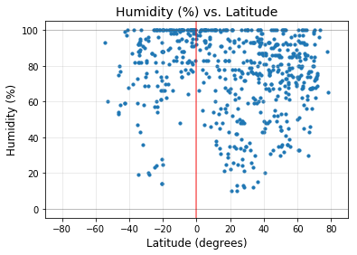
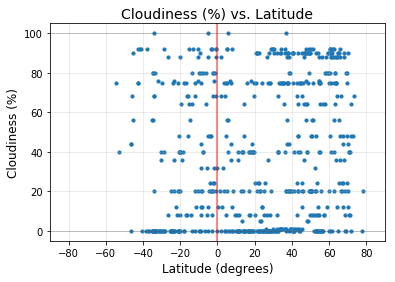
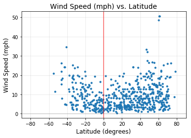

```python
import json
import openweathermapy.core as ow
from citipy import citipy
import matplotlib.pyplot as plt
import pandas as pd
import numpy as np
from config import apikey
import random
import requests
import urllib
import time
import os
```


```python
def city_string(lat,long):
    c = citipy.nearest_city(lat,long)
    return c.city_name+","+c.country_code
```


```python
outdir = "Resources"
jpath = os.path.join(outdir, "results.json")
csvpath = os.path.join(outdir, "cities.csv")
def imagepath(name):
    return os.path.join(outdir, f"{name}.png")
```


```python
#Only run this once!
i=0
#numCities=10
numCities=600
cities = []
results = []

#Loop through random coordinates, until we have enough (600) unique cities
#that return data from OWM. In the event that the city doesn't match, 
#print the result but don't count it. Add all extracted city data to a list.
while i < numCities:
    lat = random.random()*180-90
    lng = random.random()*360-180
    query=city_string(lat,lng)
    
    if query not in cities:
        cities.append(query)
        time.sleep(0.1)
        try:
            res = ow.get_current(query, units="imperial", appid = apikey)
            print(f"{i}: Gathered data for {res['name']}")
            print(f"{ow.BASE_URL}weather?q={query}&units=imperial&appid=(get your own)")
            i+=1
            results.append(res)
        except urllib.error.HTTPError as err:
            if err.code == 404:
                print(f"[{i}.x]: No data for {query}")
                print(f"{ow.BASE_URL}weather?q={query}&units=imperial&appid=(get your own)")
            elif err.code == 401:
                print("api code, man.")
                break
            else:
                raise

print(f"{numCities} out of {len(cities)} matched")
```

    0: Gathered data for Avarua
    http://api.openweathermap.org/data/2.5/weather?q=avarua,ck&units=imperial&appid=(get your own)
    1: Gathered data for Yarada
    http://api.openweathermap.org/data/2.5/weather?q=yarada,in&units=imperial&appid=(get your own)
    2: Gathered data for Mahebourg
    http://api.openweathermap.org/data/2.5/weather?q=mahebourg,mu&units=imperial&appid=(get your own)
    [3.x]: No data for taolanaro,mg
    http://api.openweathermap.org/data/2.5/weather?q=taolanaro,mg&units=imperial&appid=(get your own)
    3: Gathered data for Atuona
    http://api.openweathermap.org/data/2.5/weather?q=atuona,pf&units=imperial&appid=(get your own)
    4: Gathered data for Cabo San Lucas
    http://api.openweathermap.org/data/2.5/weather?q=cabo san lucas,mx&units=imperial&appid=(get your own)
    [5.x]: No data for airai,pw
    http://api.openweathermap.org/data/2.5/weather?q=airai,pw&units=imperial&appid=(get your own)
    5: Gathered data for Kabinda
    http://api.openweathermap.org/data/2.5/weather?q=kabinda,cd&units=imperial&appid=(get your own)
    6: Gathered data for Mahmudabad
    http://api.openweathermap.org/data/2.5/weather?q=mahmudabad,in&units=imperial&appid=(get your own)
    7: Gathered data for Inta
    http://api.openweathermap.org/data/2.5/weather?q=inta,ru&units=imperial&appid=(get your own)
    8: Gathered data for Hay River
    http://api.openweathermap.org/data/2.5/weather?q=hay river,ca&units=imperial&appid=(get your own)
    9: Gathered data for Lewisporte
    http://api.openweathermap.org/data/2.5/weather?q=lewisporte,ca&units=imperial&appid=(get your own)
    10: Gathered data for Bichena
    http://api.openweathermap.org/data/2.5/weather?q=bichena,et&units=imperial&appid=(get your own)
    11: Gathered data for Falun
    http://api.openweathermap.org/data/2.5/weather?q=falun,se&units=imperial&appid=(get your own)
    12: Gathered data for Hithadhoo
    http://api.openweathermap.org/data/2.5/weather?q=hithadhoo,mv&units=imperial&appid=(get your own)
    13: Gathered data for Chokurdakh
    http://api.openweathermap.org/data/2.5/weather?q=chokurdakh,ru&units=imperial&appid=(get your own)
    14: Gathered data for Kapaa
    http://api.openweathermap.org/data/2.5/weather?q=kapaa,us&units=imperial&appid=(get your own)
    15: Gathered data for Bandundu
    http://api.openweathermap.org/data/2.5/weather?q=bandundu,cd&units=imperial&appid=(get your own)
    [16.x]: No data for tingrela,ci
    http://api.openweathermap.org/data/2.5/weather?q=tingrela,ci&units=imperial&appid=(get your own)
    16: Gathered data for Bambous Virieux
    http://api.openweathermap.org/data/2.5/weather?q=bambous virieux,mu&units=imperial&appid=(get your own)
    17: Gathered data for Carnarvon
    http://api.openweathermap.org/data/2.5/weather?q=carnarvon,au&units=imperial&appid=(get your own)
    [18.x]: No data for mocambique,mz
    http://api.openweathermap.org/data/2.5/weather?q=mocambique,mz&units=imperial&appid=(get your own)
    [18.x]: No data for zhanatas,kz
    http://api.openweathermap.org/data/2.5/weather?q=zhanatas,kz&units=imperial&appid=(get your own)
    18: Gathered data for Novomalorossiyskaya
    http://api.openweathermap.org/data/2.5/weather?q=novomalorossiyskaya,ru&units=imperial&appid=(get your own)
    19: Gathered data for Rancho Palos Verdes
    http://api.openweathermap.org/data/2.5/weather?q=rancho palos verdes,us&units=imperial&appid=(get your own)
    20: Gathered data for Saldanha
    http://api.openweathermap.org/data/2.5/weather?q=saldanha,za&units=imperial&appid=(get your own)
    21: Gathered data for Port Hardy
    http://api.openweathermap.org/data/2.5/weather?q=port hardy,ca&units=imperial&appid=(get your own)
    22: Gathered data for Pilar
    http://api.openweathermap.org/data/2.5/weather?q=pilar,ph&units=imperial&appid=(get your own)
    23: Gathered data for Santa Fe
    http://api.openweathermap.org/data/2.5/weather?q=santa fe,cu&units=imperial&appid=(get your own)
    24: Gathered data for Bredasdorp
    http://api.openweathermap.org/data/2.5/weather?q=bredasdorp,za&units=imperial&appid=(get your own)
    25: Gathered data for Bethel
    http://api.openweathermap.org/data/2.5/weather?q=bethel,us&units=imperial&appid=(get your own)
    [26.x]: No data for belushya guba,ru
    http://api.openweathermap.org/data/2.5/weather?q=belushya guba,ru&units=imperial&appid=(get your own)
    26: Gathered data for Manado
    http://api.openweathermap.org/data/2.5/weather?q=manado,id&units=imperial&appid=(get your own)
    27: Gathered data for Qaanaaq
    http://api.openweathermap.org/data/2.5/weather?q=qaanaaq,gl&units=imperial&appid=(get your own)
    28: Gathered data for Waingapu
    http://api.openweathermap.org/data/2.5/weather?q=waingapu,id&units=imperial&appid=(get your own)
    29: Gathered data for Hermanus
    http://api.openweathermap.org/data/2.5/weather?q=hermanus,za&units=imperial&appid=(get your own)
    30: Gathered data for Rapar
    http://api.openweathermap.org/data/2.5/weather?q=rapar,in&units=imperial&appid=(get your own)
    31: Gathered data for Albany
    http://api.openweathermap.org/data/2.5/weather?q=albany,au&units=imperial&appid=(get your own)
    32: Gathered data for Geraldton
    http://api.openweathermap.org/data/2.5/weather?q=geraldton,ca&units=imperial&appid=(get your own)
    33: Gathered data for Rikitea
    http://api.openweathermap.org/data/2.5/weather?q=rikitea,pf&units=imperial&appid=(get your own)
    34: Gathered data for Butaritari
    http://api.openweathermap.org/data/2.5/weather?q=butaritari,ki&units=imperial&appid=(get your own)
    35: Gathered data for Svetlogorsk
    http://api.openweathermap.org/data/2.5/weather?q=svetlogorsk,ru&units=imperial&appid=(get your own)
    36: Gathered data for Lebu
    http://api.openweathermap.org/data/2.5/weather?q=lebu,cl&units=imperial&appid=(get your own)
    37: Gathered data for Rovinj
    http://api.openweathermap.org/data/2.5/weather?q=rovinj,hr&units=imperial&appid=(get your own)
    38: Gathered data for Luganville
    http://api.openweathermap.org/data/2.5/weather?q=luganville,vu&units=imperial&appid=(get your own)
    39: Gathered data for Mago
    http://api.openweathermap.org/data/2.5/weather?q=mago,ru&units=imperial&appid=(get your own)
    40: Gathered data for Yuanping
    http://api.openweathermap.org/data/2.5/weather?q=yuanping,cn&units=imperial&appid=(get your own)
    41: Gathered data for Souillac
    http://api.openweathermap.org/data/2.5/weather?q=souillac,mu&units=imperial&appid=(get your own)
    42: Gathered data for Flinders
    http://api.openweathermap.org/data/2.5/weather?q=flinders,au&units=imperial&appid=(get your own)
    43: Gathered data for Beloha
    http://api.openweathermap.org/data/2.5/weather?q=beloha,mg&units=imperial&appid=(get your own)
    44: Gathered data for Hasaki
    http://api.openweathermap.org/data/2.5/weather?q=hasaki,jp&units=imperial&appid=(get your own)
    45: Gathered data for Busselton
    http://api.openweathermap.org/data/2.5/weather?q=busselton,au&units=imperial&appid=(get your own)
    46: Gathered data for Sao Joao da Barra
    http://api.openweathermap.org/data/2.5/weather?q=sao joao da barra,br&units=imperial&appid=(get your own)
    47: Gathered data for Port Alfred
    http://api.openweathermap.org/data/2.5/weather?q=port alfred,za&units=imperial&appid=(get your own)
    48: Gathered data for Isangel
    http://api.openweathermap.org/data/2.5/weather?q=isangel,vu&units=imperial&appid=(get your own)
    49: Gathered data for Maiduguri
    http://api.openweathermap.org/data/2.5/weather?q=maiduguri,ng&units=imperial&appid=(get your own)
    50: Gathered data for Omboue
    http://api.openweathermap.org/data/2.5/weather?q=omboue,ga&units=imperial&appid=(get your own)
    51: Gathered data for Hobart
    http://api.openweathermap.org/data/2.5/weather?q=hobart,au&units=imperial&appid=(get your own)
    52: Gathered data for Bluff
    http://api.openweathermap.org/data/2.5/weather?q=bluff,nz&units=imperial&appid=(get your own)
    53: Gathered data for North Myrtle Beach
    http://api.openweathermap.org/data/2.5/weather?q=north myrtle beach,us&units=imperial&appid=(get your own)
    54: Gathered data for Norman Wells
    http://api.openweathermap.org/data/2.5/weather?q=norman wells,ca&units=imperial&appid=(get your own)
    [55.x]: No data for mataura,pf
    http://api.openweathermap.org/data/2.5/weather?q=mataura,pf&units=imperial&appid=(get your own)
    [55.x]: No data for nizhneyansk,ru
    http://api.openweathermap.org/data/2.5/weather?q=nizhneyansk,ru&units=imperial&appid=(get your own)
    55: Gathered data for Belaya Gora
    http://api.openweathermap.org/data/2.5/weather?q=belaya gora,ru&units=imperial&appid=(get your own)
    56: Gathered data for Tashtyp
    http://api.openweathermap.org/data/2.5/weather?q=tashtyp,ru&units=imperial&appid=(get your own)
    57: Gathered data for Petropavlovsk-Kamchatskiy
    http://api.openweathermap.org/data/2.5/weather?q=petropavlovsk-kamchatskiy,ru&units=imperial&appid=(get your own)
    [58.x]: No data for barentsburg,sj
    http://api.openweathermap.org/data/2.5/weather?q=barentsburg,sj&units=imperial&appid=(get your own)
    58: Gathered data for Kirakira
    http://api.openweathermap.org/data/2.5/weather?q=kirakira,sb&units=imperial&appid=(get your own)
    59: Gathered data for Sinnamary
    http://api.openweathermap.org/data/2.5/weather?q=sinnamary,gf&units=imperial&appid=(get your own)
    60: Gathered data for Jacareacanga
    http://api.openweathermap.org/data/2.5/weather?q=jacareacanga,br&units=imperial&appid=(get your own)
    61: Gathered data for Duluth
    http://api.openweathermap.org/data/2.5/weather?q=duluth,us&units=imperial&appid=(get your own)
    62: Gathered data for Senador Jose Porfirio
    http://api.openweathermap.org/data/2.5/weather?q=senador jose porfirio,br&units=imperial&appid=(get your own)
    63: Gathered data for Sorong
    http://api.openweathermap.org/data/2.5/weather?q=sorong,id&units=imperial&appid=(get your own)
    64: Gathered data for Ushuaia
    http://api.openweathermap.org/data/2.5/weather?q=ushuaia,ar&units=imperial&appid=(get your own)
    65: Gathered data for Ancud
    http://api.openweathermap.org/data/2.5/weather?q=ancud,cl&units=imperial&appid=(get your own)
    66: Gathered data for Nakamura
    http://api.openweathermap.org/data/2.5/weather?q=nakamura,jp&units=imperial&appid=(get your own)
    67: Gathered data for Barrow
    http://api.openweathermap.org/data/2.5/weather?q=barrow,us&units=imperial&appid=(get your own)
    68: Gathered data for Carauari
    http://api.openweathermap.org/data/2.5/weather?q=carauari,br&units=imperial&appid=(get your own)
    69: Gathered data for Homer
    http://api.openweathermap.org/data/2.5/weather?q=homer,us&units=imperial&appid=(get your own)
    [70.x]: No data for saleaula,ws
    http://api.openweathermap.org/data/2.5/weather?q=saleaula,ws&units=imperial&appid=(get your own)
    70: Gathered data for Artyom
    http://api.openweathermap.org/data/2.5/weather?q=artyom,az&units=imperial&appid=(get your own)
    71: Gathered data for Cape Town
    http://api.openweathermap.org/data/2.5/weather?q=cape town,za&units=imperial&appid=(get your own)
    72: Gathered data for Gizo
    http://api.openweathermap.org/data/2.5/weather?q=gizo,sb&units=imperial&appid=(get your own)
    73: Gathered data for Tomatlan
    http://api.openweathermap.org/data/2.5/weather?q=tomatlan,mx&units=imperial&appid=(get your own)
    74: Gathered data for Punta Arenas
    http://api.openweathermap.org/data/2.5/weather?q=punta arenas,cl&units=imperial&appid=(get your own)
    75: Gathered data for Puerto Ayora
    http://api.openweathermap.org/data/2.5/weather?q=puerto ayora,ec&units=imperial&appid=(get your own)
    76: Gathered data for Faanui
    http://api.openweathermap.org/data/2.5/weather?q=faanui,pf&units=imperial&appid=(get your own)
    77: Gathered data for Palmer
    http://api.openweathermap.org/data/2.5/weather?q=palmer,us&units=imperial&appid=(get your own)
    78: Gathered data for Kefalos
    http://api.openweathermap.org/data/2.5/weather?q=kefalos,gr&units=imperial&appid=(get your own)
    79: Gathered data for Portland
    http://api.openweathermap.org/data/2.5/weather?q=portland,au&units=imperial&appid=(get your own)
    80: Gathered data for Upernavik
    http://api.openweathermap.org/data/2.5/weather?q=upernavik,gl&units=imperial&appid=(get your own)
    81: Gathered data for Rocha
    http://api.openweathermap.org/data/2.5/weather?q=rocha,uy&units=imperial&appid=(get your own)
    82: Gathered data for Xiuyan
    http://api.openweathermap.org/data/2.5/weather?q=xiuyan,cn&units=imperial&appid=(get your own)
    83: Gathered data for Gunjur
    http://api.openweathermap.org/data/2.5/weather?q=gunjur,gm&units=imperial&appid=(get your own)
    84: Gathered data for Koumac
    http://api.openweathermap.org/data/2.5/weather?q=koumac,nc&units=imperial&appid=(get your own)
    85: Gathered data for Nikolskoye
    http://api.openweathermap.org/data/2.5/weather?q=nikolskoye,ru&units=imperial&appid=(get your own)
    86: Gathered data for Vaini
    http://api.openweathermap.org/data/2.5/weather?q=vaini,to&units=imperial&appid=(get your own)
    87: Gathered data for Madaoua
    http://api.openweathermap.org/data/2.5/weather?q=madaoua,ne&units=imperial&appid=(get your own)
    [88.x]: No data for illoqqortoormiut,gl
    http://api.openweathermap.org/data/2.5/weather?q=illoqqortoormiut,gl&units=imperial&appid=(get your own)
    88: Gathered data for Narsaq
    http://api.openweathermap.org/data/2.5/weather?q=narsaq,gl&units=imperial&appid=(get your own)
    89: Gathered data for Pisco
    http://api.openweathermap.org/data/2.5/weather?q=pisco,pe&units=imperial&appid=(get your own)
    90: Gathered data for Labuhan
    http://api.openweathermap.org/data/2.5/weather?q=labuhan,id&units=imperial&appid=(get your own)
    91: Gathered data for Nicoya
    http://api.openweathermap.org/data/2.5/weather?q=nicoya,cr&units=imperial&appid=(get your own)
    92: Gathered data for Severo-Kurilsk
    http://api.openweathermap.org/data/2.5/weather?q=severo-kurilsk,ru&units=imperial&appid=(get your own)
    93: Gathered data for Barcelos
    http://api.openweathermap.org/data/2.5/weather?q=barcelos,br&units=imperial&appid=(get your own)
    94: Gathered data for Marienburg
    http://api.openweathermap.org/data/2.5/weather?q=marienburg,sr&units=imperial&appid=(get your own)
    [95.x]: No data for lolua,tv
    http://api.openweathermap.org/data/2.5/weather?q=lolua,tv&units=imperial&appid=(get your own)
    [95.x]: No data for attawapiskat,ca
    http://api.openweathermap.org/data/2.5/weather?q=attawapiskat,ca&units=imperial&appid=(get your own)
    95: Gathered data for Coachella
    http://api.openweathermap.org/data/2.5/weather?q=coachella,us&units=imperial&appid=(get your own)
    96: Gathered data for Dingle
    http://api.openweathermap.org/data/2.5/weather?q=dingle,ie&units=imperial&appid=(get your own)
    97: Gathered data for Podosinovets
    http://api.openweathermap.org/data/2.5/weather?q=podosinovets,ru&units=imperial&appid=(get your own)
    98: Gathered data for Tekari
    http://api.openweathermap.org/data/2.5/weather?q=tekari,in&units=imperial&appid=(get your own)
    99: Gathered data for Necochea
    http://api.openweathermap.org/data/2.5/weather?q=necochea,ar&units=imperial&appid=(get your own)
    100: Gathered data for Caravelas
    http://api.openweathermap.org/data/2.5/weather?q=caravelas,br&units=imperial&appid=(get your own)
    101: Gathered data for Calderara di Reno
    http://api.openweathermap.org/data/2.5/weather?q=calderara di reno,it&units=imperial&appid=(get your own)
    102: Gathered data for Parana
    http://api.openweathermap.org/data/2.5/weather?q=parana,br&units=imperial&appid=(get your own)
    103: Gathered data for Beaufort
    http://api.openweathermap.org/data/2.5/weather?q=beaufort,us&units=imperial&appid=(get your own)
    [104.x]: No data for tsihombe,mg
    http://api.openweathermap.org/data/2.5/weather?q=tsihombe,mg&units=imperial&appid=(get your own)
    104: Gathered data for East London
    http://api.openweathermap.org/data/2.5/weather?q=east london,za&units=imperial&appid=(get your own)
    105: Gathered data for Kodiak
    http://api.openweathermap.org/data/2.5/weather?q=kodiak,us&units=imperial&appid=(get your own)
    [106.x]: No data for bengkulu,id
    http://api.openweathermap.org/data/2.5/weather?q=bengkulu,id&units=imperial&appid=(get your own)
    106: Gathered data for Gudari
    http://api.openweathermap.org/data/2.5/weather?q=gudari,in&units=imperial&appid=(get your own)
    107: Gathered data for Sandovo
    http://api.openweathermap.org/data/2.5/weather?q=sandovo,ru&units=imperial&appid=(get your own)
    108: Gathered data for Villa Union
    http://api.openweathermap.org/data/2.5/weather?q=villa union,mx&units=imperial&appid=(get your own)
    109: Gathered data for Matagami
    http://api.openweathermap.org/data/2.5/weather?q=matagami,ca&units=imperial&appid=(get your own)
    110: Gathered data for Peniche
    http://api.openweathermap.org/data/2.5/weather?q=peniche,pt&units=imperial&appid=(get your own)
    111: Gathered data for Jamestown
    http://api.openweathermap.org/data/2.5/weather?q=jamestown,sh&units=imperial&appid=(get your own)
    [112.x]: No data for formoso do araguaia,br
    http://api.openweathermap.org/data/2.5/weather?q=formoso do araguaia,br&units=imperial&appid=(get your own)
    [112.x]: No data for karakendzha,tj
    http://api.openweathermap.org/data/2.5/weather?q=karakendzha,tj&units=imperial&appid=(get your own)
    112: Gathered data for San Cristobal
    http://api.openweathermap.org/data/2.5/weather?q=san cristobal,ec&units=imperial&appid=(get your own)
    113: Gathered data for Sao Gabriel da Cachoeira
    http://api.openweathermap.org/data/2.5/weather?q=sao gabriel da cachoeira,br&units=imperial&appid=(get your own)
    114: Gathered data for Muros
    http://api.openweathermap.org/data/2.5/weather?q=muros,es&units=imperial&appid=(get your own)
    115: Gathered data for Skjervoy
    http://api.openweathermap.org/data/2.5/weather?q=skjervoy,no&units=imperial&appid=(get your own)
    116: Gathered data for Ostrovnoy
    http://api.openweathermap.org/data/2.5/weather?q=ostrovnoy,ru&units=imperial&appid=(get your own)
    [117.x]: No data for achisay,kz
    http://api.openweathermap.org/data/2.5/weather?q=achisay,kz&units=imperial&appid=(get your own)
    117: Gathered data for Saskylakh
    http://api.openweathermap.org/data/2.5/weather?q=saskylakh,ru&units=imperial&appid=(get your own)
    118: Gathered data for Saint-Philippe
    http://api.openweathermap.org/data/2.5/weather?q=saint-philippe,re&units=imperial&appid=(get your own)
    119: Gathered data for Arraial do Cabo
    http://api.openweathermap.org/data/2.5/weather?q=arraial do cabo,br&units=imperial&appid=(get your own)
    120: Gathered data for Grindavik
    http://api.openweathermap.org/data/2.5/weather?q=grindavik,is&units=imperial&appid=(get your own)
    121: Gathered data for Bilma
    http://api.openweathermap.org/data/2.5/weather?q=bilma,ne&units=imperial&appid=(get your own)
    122: Gathered data for Yellowknife
    http://api.openweathermap.org/data/2.5/weather?q=yellowknife,ca&units=imperial&appid=(get your own)
    123: Gathered data for Galashki
    http://api.openweathermap.org/data/2.5/weather?q=galashki,ru&units=imperial&appid=(get your own)
    124: Gathered data for Saint George
    http://api.openweathermap.org/data/2.5/weather?q=saint george,bm&units=imperial&appid=(get your own)
    [125.x]: No data for laguna,br
    http://api.openweathermap.org/data/2.5/weather?q=laguna,br&units=imperial&appid=(get your own)
    125: Gathered data for Salina
    http://api.openweathermap.org/data/2.5/weather?q=salina,us&units=imperial&appid=(get your own)
    126: Gathered data for Poum
    http://api.openweathermap.org/data/2.5/weather?q=poum,nc&units=imperial&appid=(get your own)
    [127.x]: No data for grand river south east,mu
    http://api.openweathermap.org/data/2.5/weather?q=grand river south east,mu&units=imperial&appid=(get your own)
    127: Gathered data for Hilo
    http://api.openweathermap.org/data/2.5/weather?q=hilo,us&units=imperial&appid=(get your own)
    128: Gathered data for Hun
    http://api.openweathermap.org/data/2.5/weather?q=hun,ly&units=imperial&appid=(get your own)
    [129.x]: No data for kuche,cn
    http://api.openweathermap.org/data/2.5/weather?q=kuche,cn&units=imperial&appid=(get your own)
    129: Gathered data for Anadyr
    http://api.openweathermap.org/data/2.5/weather?q=anadyr,ru&units=imperial&appid=(get your own)
    130: Gathered data for Ribeira Grande
    http://api.openweathermap.org/data/2.5/weather?q=ribeira grande,pt&units=imperial&appid=(get your own)
    [131.x]: No data for alappuzha,in
    http://api.openweathermap.org/data/2.5/weather?q=alappuzha,in&units=imperial&appid=(get your own)
    131: Gathered data for Guaiba
    http://api.openweathermap.org/data/2.5/weather?q=guaiba,br&units=imperial&appid=(get your own)
    132: Gathered data for Khatanga
    http://api.openweathermap.org/data/2.5/weather?q=khatanga,ru&units=imperial&appid=(get your own)
    133: Gathered data for Dodge City
    http://api.openweathermap.org/data/2.5/weather?q=dodge city,us&units=imperial&appid=(get your own)
    134: Gathered data for Provideniya
    http://api.openweathermap.org/data/2.5/weather?q=provideniya,ru&units=imperial&appid=(get your own)
    135: Gathered data for Kadaya
    http://api.openweathermap.org/data/2.5/weather?q=kadaya,ru&units=imperial&appid=(get your own)
    136: Gathered data for Sept-Iles
    http://api.openweathermap.org/data/2.5/weather?q=sept-iles,ca&units=imperial&appid=(get your own)
    137: Gathered data for Alice Springs
    http://api.openweathermap.org/data/2.5/weather?q=alice springs,au&units=imperial&appid=(get your own)
    138: Gathered data for Iroquois Falls
    http://api.openweathermap.org/data/2.5/weather?q=iroquois falls,ca&units=imperial&appid=(get your own)
    [139.x]: No data for ler,sd
    http://api.openweathermap.org/data/2.5/weather?q=ler,sd&units=imperial&appid=(get your own)
    139: Gathered data for Qostanay
    http://api.openweathermap.org/data/2.5/weather?q=qostanay,kz&units=imperial&appid=(get your own)
    140: Gathered data for Kushchevskaya
    http://api.openweathermap.org/data/2.5/weather?q=kushchevskaya,ru&units=imperial&appid=(get your own)
    141: Gathered data for Coracora
    http://api.openweathermap.org/data/2.5/weather?q=coracora,pe&units=imperial&appid=(get your own)
    142: Gathered data for Namibe
    http://api.openweathermap.org/data/2.5/weather?q=namibe,ao&units=imperial&appid=(get your own)
    143: Gathered data for Shemonaikha
    http://api.openweathermap.org/data/2.5/weather?q=shemonaikha,kz&units=imperial&appid=(get your own)
    144: Gathered data for Kaitangata
    http://api.openweathermap.org/data/2.5/weather?q=kaitangata,nz&units=imperial&appid=(get your own)
    145: Gathered data for Manuk Mangkaw
    http://api.openweathermap.org/data/2.5/weather?q=manuk mangkaw,ph&units=imperial&appid=(get your own)
    146: Gathered data for Springbok
    http://api.openweathermap.org/data/2.5/weather?q=springbok,za&units=imperial&appid=(get your own)
    147: Gathered data for Dawlatabad
    http://api.openweathermap.org/data/2.5/weather?q=dawlatabad,af&units=imperial&appid=(get your own)
    148: Gathered data for Lagoa
    http://api.openweathermap.org/data/2.5/weather?q=lagoa,pt&units=imperial&appid=(get your own)
    149: Gathered data for Vadso
    http://api.openweathermap.org/data/2.5/weather?q=vadso,no&units=imperial&appid=(get your own)
    150: Gathered data for Pithoro
    http://api.openweathermap.org/data/2.5/weather?q=pithoro,pk&units=imperial&appid=(get your own)
    151: Gathered data for Pacific Grove
    http://api.openweathermap.org/data/2.5/weather?q=pacific grove,us&units=imperial&appid=(get your own)
    152: Gathered data for Naze
    http://api.openweathermap.org/data/2.5/weather?q=naze,jp&units=imperial&appid=(get your own)
    153: Gathered data for Victoria
    http://api.openweathermap.org/data/2.5/weather?q=victoria,sc&units=imperial&appid=(get your own)
    154: Gathered data for Kortkeros
    http://api.openweathermap.org/data/2.5/weather?q=kortkeros,ru&units=imperial&appid=(get your own)
    155: Gathered data for Kehra
    http://api.openweathermap.org/data/2.5/weather?q=kehra,ee&units=imperial&appid=(get your own)
    156: Gathered data for Baijiantan
    http://api.openweathermap.org/data/2.5/weather?q=baijiantan,cn&units=imperial&appid=(get your own)
    157: Gathered data for Lima
    http://api.openweathermap.org/data/2.5/weather?q=lima,pe&units=imperial&appid=(get your own)
    [158.x]: No data for tumannyy,ru
    http://api.openweathermap.org/data/2.5/weather?q=tumannyy,ru&units=imperial&appid=(get your own)
    158: Gathered data for Dikson
    http://api.openweathermap.org/data/2.5/weather?q=dikson,ru&units=imperial&appid=(get your own)
    159: Gathered data for La Ronge
    http://api.openweathermap.org/data/2.5/weather?q=la ronge,ca&units=imperial&appid=(get your own)
    [160.x]: No data for sakakah,sa
    http://api.openweathermap.org/data/2.5/weather?q=sakakah,sa&units=imperial&appid=(get your own)
    160: Gathered data for Mehamn
    http://api.openweathermap.org/data/2.5/weather?q=mehamn,no&units=imperial&appid=(get your own)
    161: Gathered data for Orocue
    http://api.openweathermap.org/data/2.5/weather?q=orocue,co&units=imperial&appid=(get your own)
    162: Gathered data for Okhotsk
    http://api.openweathermap.org/data/2.5/weather?q=okhotsk,ru&units=imperial&appid=(get your own)
    163: Gathered data for Katsuura
    http://api.openweathermap.org/data/2.5/weather?q=katsuura,jp&units=imperial&appid=(get your own)
    [164.x]: No data for umm durman,sd
    http://api.openweathermap.org/data/2.5/weather?q=umm durman,sd&units=imperial&appid=(get your own)
    164: Gathered data for Las Choapas
    http://api.openweathermap.org/data/2.5/weather?q=las choapas,mx&units=imperial&appid=(get your own)
    [165.x]: No data for amderma,ru
    http://api.openweathermap.org/data/2.5/weather?q=amderma,ru&units=imperial&appid=(get your own)
    165: Gathered data for Baturaja
    http://api.openweathermap.org/data/2.5/weather?q=baturaja,id&units=imperial&appid=(get your own)
    166: Gathered data for Ferrol
    http://api.openweathermap.org/data/2.5/weather?q=ferrol,es&units=imperial&appid=(get your own)
    167: Gathered data for Beringovskiy
    http://api.openweathermap.org/data/2.5/weather?q=beringovskiy,ru&units=imperial&appid=(get your own)
    168: Gathered data for Thompson
    http://api.openweathermap.org/data/2.5/weather?q=thompson,ca&units=imperial&appid=(get your own)
    169: Gathered data for Jinan
    http://api.openweathermap.org/data/2.5/weather?q=jinan,cn&units=imperial&appid=(get your own)
    170: Gathered data for Sungaipenuh
    http://api.openweathermap.org/data/2.5/weather?q=sungaipenuh,id&units=imperial&appid=(get your own)
    [171.x]: No data for dekoa,cf
    http://api.openweathermap.org/data/2.5/weather?q=dekoa,cf&units=imperial&appid=(get your own)
    171: Gathered data for Shimanovsk
    http://api.openweathermap.org/data/2.5/weather?q=shimanovsk,ru&units=imperial&appid=(get your own)
    172: Gathered data for Neiafu
    http://api.openweathermap.org/data/2.5/weather?q=neiafu,to&units=imperial&appid=(get your own)
    173: Gathered data for Coquimbo
    http://api.openweathermap.org/data/2.5/weather?q=coquimbo,cl&units=imperial&appid=(get your own)
    174: Gathered data for Morondava
    http://api.openweathermap.org/data/2.5/weather?q=morondava,mg&units=imperial&appid=(get your own)
    [175.x]: No data for camana,pe
    http://api.openweathermap.org/data/2.5/weather?q=camana,pe&units=imperial&appid=(get your own)
    175: Gathered data for Luba
    http://api.openweathermap.org/data/2.5/weather?q=luba,gq&units=imperial&appid=(get your own)
    176: Gathered data for Mount Gambier
    http://api.openweathermap.org/data/2.5/weather?q=mount gambier,au&units=imperial&appid=(get your own)
    177: Gathered data for New Norfolk
    http://api.openweathermap.org/data/2.5/weather?q=new norfolk,au&units=imperial&appid=(get your own)
    178: Gathered data for Touros
    http://api.openweathermap.org/data/2.5/weather?q=touros,br&units=imperial&appid=(get your own)
    179: Gathered data for Charters Towers
    http://api.openweathermap.org/data/2.5/weather?q=charters towers,au&units=imperial&appid=(get your own)
    [180.x]: No data for asau,tv
    http://api.openweathermap.org/data/2.5/weather?q=asau,tv&units=imperial&appid=(get your own)
    180: Gathered data for Inhambane
    http://api.openweathermap.org/data/2.5/weather?q=inhambane,mz&units=imperial&appid=(get your own)
    181: Gathered data for Blackwater
    http://api.openweathermap.org/data/2.5/weather?q=blackwater,au&units=imperial&appid=(get your own)
    182: Gathered data for Libertador General San Martin
    http://api.openweathermap.org/data/2.5/weather?q=libertador general san martin,ar&units=imperial&appid=(get your own)
    [183.x]: No data for ituni,gy
    http://api.openweathermap.org/data/2.5/weather?q=ituni,gy&units=imperial&appid=(get your own)
    183: Gathered data for Findlay
    http://api.openweathermap.org/data/2.5/weather?q=findlay,us&units=imperial&appid=(get your own)
    184: Gathered data for Surt
    http://api.openweathermap.org/data/2.5/weather?q=surt,ly&units=imperial&appid=(get your own)
    [185.x]: No data for fatikchhari,bd
    http://api.openweathermap.org/data/2.5/weather?q=fatikchhari,bd&units=imperial&appid=(get your own)
    185: Gathered data for Ormara
    http://api.openweathermap.org/data/2.5/weather?q=ormara,pk&units=imperial&appid=(get your own)
    186: Gathered data for Kasama
    http://api.openweathermap.org/data/2.5/weather?q=kasama,zm&units=imperial&appid=(get your own)
    [187.x]: No data for palabuhanratu,id
    http://api.openweathermap.org/data/2.5/weather?q=palabuhanratu,id&units=imperial&appid=(get your own)
    187: Gathered data for Ciudad Bolivar
    http://api.openweathermap.org/data/2.5/weather?q=ciudad bolivar,ve&units=imperial&appid=(get your own)
    188: Gathered data for Katherine
    http://api.openweathermap.org/data/2.5/weather?q=katherine,au&units=imperial&appid=(get your own)
    189: Gathered data for Sitka
    http://api.openweathermap.org/data/2.5/weather?q=sitka,us&units=imperial&appid=(get your own)
    [190.x]: No data for ust-kamchatsk,ru
    http://api.openweathermap.org/data/2.5/weather?q=ust-kamchatsk,ru&units=imperial&appid=(get your own)
    190: Gathered data for Pangnirtung
    http://api.openweathermap.org/data/2.5/weather?q=pangnirtung,ca&units=imperial&appid=(get your own)
    191: Gathered data for Castro
    http://api.openweathermap.org/data/2.5/weather?q=castro,cl&units=imperial&appid=(get your own)
    192: Gathered data for Ukiah
    http://api.openweathermap.org/data/2.5/weather?q=ukiah,us&units=imperial&appid=(get your own)
    193: Gathered data for Westport
    http://api.openweathermap.org/data/2.5/weather?q=westport,ie&units=imperial&appid=(get your own)
    194: Gathered data for Ano Mera
    http://api.openweathermap.org/data/2.5/weather?q=ano mera,gr&units=imperial&appid=(get your own)
    195: Gathered data for Campbell River
    http://api.openweathermap.org/data/2.5/weather?q=campbell river,ca&units=imperial&appid=(get your own)
    196: Gathered data for Esperance
    http://api.openweathermap.org/data/2.5/weather?q=esperance,au&units=imperial&appid=(get your own)
    197: Gathered data for Tuktoyaktuk
    http://api.openweathermap.org/data/2.5/weather?q=tuktoyaktuk,ca&units=imperial&appid=(get your own)
    198: Gathered data for Cananeia
    http://api.openweathermap.org/data/2.5/weather?q=cananeia,br&units=imperial&appid=(get your own)
    199: Gathered data for Gibara
    http://api.openweathermap.org/data/2.5/weather?q=gibara,cu&units=imperial&appid=(get your own)
    200: Gathered data for Katobu
    http://api.openweathermap.org/data/2.5/weather?q=katobu,id&units=imperial&appid=(get your own)
    201: Gathered data for Haines Junction
    http://api.openweathermap.org/data/2.5/weather?q=haines junction,ca&units=imperial&appid=(get your own)
    202: Gathered data for Qaqortoq
    http://api.openweathermap.org/data/2.5/weather?q=qaqortoq,gl&units=imperial&appid=(get your own)
    [203.x]: No data for vaitupu,wf
    http://api.openweathermap.org/data/2.5/weather?q=vaitupu,wf&units=imperial&appid=(get your own)
    203: Gathered data for Minot
    http://api.openweathermap.org/data/2.5/weather?q=minot,us&units=imperial&appid=(get your own)
    204: Gathered data for Longyearbyen
    http://api.openweathermap.org/data/2.5/weather?q=longyearbyen,sj&units=imperial&appid=(get your own)
    205: Gathered data for Zhuzhou
    http://api.openweathermap.org/data/2.5/weather?q=zhuzhou,cn&units=imperial&appid=(get your own)
    206: Gathered data for Lebanon
    http://api.openweathermap.org/data/2.5/weather?q=lebanon,us&units=imperial&appid=(get your own)
    207: Gathered data for Nueva Loja
    http://api.openweathermap.org/data/2.5/weather?q=nueva loja,ec&units=imperial&appid=(get your own)
    208: Gathered data for Mugango
    http://api.openweathermap.org/data/2.5/weather?q=mugango,tz&units=imperial&appid=(get your own)
    209: Gathered data for Yulara
    http://api.openweathermap.org/data/2.5/weather?q=yulara,au&units=imperial&appid=(get your own)
    210: Gathered data for Hazorasp
    http://api.openweathermap.org/data/2.5/weather?q=hazorasp,uz&units=imperial&appid=(get your own)
    211: Gathered data for Alofi
    http://api.openweathermap.org/data/2.5/weather?q=alofi,nu&units=imperial&appid=(get your own)
    [212.x]: No data for tubruq,ly
    http://api.openweathermap.org/data/2.5/weather?q=tubruq,ly&units=imperial&appid=(get your own)
    212: Gathered data for Kurumkan
    http://api.openweathermap.org/data/2.5/weather?q=kurumkan,ru&units=imperial&appid=(get your own)
    213: Gathered data for Luderitz
    http://api.openweathermap.org/data/2.5/weather?q=luderitz,na&units=imperial&appid=(get your own)
    214: Gathered data for Gien
    http://api.openweathermap.org/data/2.5/weather?q=gien,fr&units=imperial&appid=(get your own)
    215: Gathered data for Ballina
    http://api.openweathermap.org/data/2.5/weather?q=ballina,ie&units=imperial&appid=(get your own)
    216: Gathered data for Kapit
    http://api.openweathermap.org/data/2.5/weather?q=kapit,my&units=imperial&appid=(get your own)
    217: Gathered data for Havoysund
    http://api.openweathermap.org/data/2.5/weather?q=havoysund,no&units=imperial&appid=(get your own)
    218: Gathered data for Choix
    http://api.openweathermap.org/data/2.5/weather?q=choix,mx&units=imperial&appid=(get your own)
    219: Gathered data for Georgetown
    http://api.openweathermap.org/data/2.5/weather?q=georgetown,sh&units=imperial&appid=(get your own)
    220: Gathered data for Carnarvon
    http://api.openweathermap.org/data/2.5/weather?q=carnarvon,za&units=imperial&appid=(get your own)
    221: Gathered data for Luanda
    http://api.openweathermap.org/data/2.5/weather?q=luanda,ao&units=imperial&appid=(get your own)
    222: Gathered data for Moron
    http://api.openweathermap.org/data/2.5/weather?q=moron,mn&units=imperial&appid=(get your own)
    223: Gathered data for Ilhabela
    http://api.openweathermap.org/data/2.5/weather?q=ilhabela,br&units=imperial&appid=(get your own)
    224: Gathered data for Hamilton
    http://api.openweathermap.org/data/2.5/weather?q=hamilton,bm&units=imperial&appid=(get your own)
    225: Gathered data for Ocampo
    http://api.openweathermap.org/data/2.5/weather?q=ocampo,mx&units=imperial&appid=(get your own)
    226: Gathered data for Maragogi
    http://api.openweathermap.org/data/2.5/weather?q=maragogi,br&units=imperial&appid=(get your own)
    227: Gathered data for Shipitsyno
    http://api.openweathermap.org/data/2.5/weather?q=shipitsyno,ru&units=imperial&appid=(get your own)
    228: Gathered data for Zadar
    http://api.openweathermap.org/data/2.5/weather?q=zadar,hr&units=imperial&appid=(get your own)
    229: Gathered data for Vila Velha
    http://api.openweathermap.org/data/2.5/weather?q=vila velha,br&units=imperial&appid=(get your own)
    230: Gathered data for Port Elizabeth
    http://api.openweathermap.org/data/2.5/weather?q=port elizabeth,za&units=imperial&appid=(get your own)
    231: Gathered data for Cayenne
    http://api.openweathermap.org/data/2.5/weather?q=cayenne,gf&units=imperial&appid=(get your own)
    232: Gathered data for Chuy
    http://api.openweathermap.org/data/2.5/weather?q=chuy,uy&units=imperial&appid=(get your own)
    233: Gathered data for Verkh-Chebula
    http://api.openweathermap.org/data/2.5/weather?q=verkh-chebula,ru&units=imperial&appid=(get your own)
    234: Gathered data for Pachino
    http://api.openweathermap.org/data/2.5/weather?q=pachino,it&units=imperial&appid=(get your own)
    235: Gathered data for Kalmar
    http://api.openweathermap.org/data/2.5/weather?q=kalmar,se&units=imperial&appid=(get your own)
    236: Gathered data for Sadsadan
    http://api.openweathermap.org/data/2.5/weather?q=sadsadan,ph&units=imperial&appid=(get your own)
    237: Gathered data for Cherskiy
    http://api.openweathermap.org/data/2.5/weather?q=cherskiy,ru&units=imperial&appid=(get your own)
    238: Gathered data for Alta
    http://api.openweathermap.org/data/2.5/weather?q=alta,no&units=imperial&appid=(get your own)
    239: Gathered data for Lashio
    http://api.openweathermap.org/data/2.5/weather?q=lashio,mm&units=imperial&appid=(get your own)
    240: Gathered data for Mar del Plata
    http://api.openweathermap.org/data/2.5/weather?q=mar del plata,ar&units=imperial&appid=(get your own)
    241: Gathered data for Tasiilaq
    http://api.openweathermap.org/data/2.5/weather?q=tasiilaq,gl&units=imperial&appid=(get your own)
    242: Gathered data for Keratea
    http://api.openweathermap.org/data/2.5/weather?q=keratea,gr&units=imperial&appid=(get your own)
    243: Gathered data for Monopoli
    http://api.openweathermap.org/data/2.5/weather?q=monopoli,it&units=imperial&appid=(get your own)
    244: Gathered data for Canchungo
    http://api.openweathermap.org/data/2.5/weather?q=canchungo,gw&units=imperial&appid=(get your own)
    245: Gathered data for Najran
    http://api.openweathermap.org/data/2.5/weather?q=najran,sa&units=imperial&appid=(get your own)
    246: Gathered data for Riyadh
    http://api.openweathermap.org/data/2.5/weather?q=riyadh,sa&units=imperial&appid=(get your own)
    247: Gathered data for Komsomolskiy
    http://api.openweathermap.org/data/2.5/weather?q=komsomolskiy,ru&units=imperial&appid=(get your own)
    248: Gathered data for San Matias
    http://api.openweathermap.org/data/2.5/weather?q=san matias,bo&units=imperial&appid=(get your own)
    [249.x]: No data for azimur,ma
    http://api.openweathermap.org/data/2.5/weather?q=azimur,ma&units=imperial&appid=(get your own)
    249: Gathered data for Prince Rupert
    http://api.openweathermap.org/data/2.5/weather?q=prince rupert,ca&units=imperial&appid=(get your own)
    250: Gathered data for Fershampenuaz
    http://api.openweathermap.org/data/2.5/weather?q=fershampenuaz,ru&units=imperial&appid=(get your own)
    [251.x]: No data for bur gabo,so
    http://api.openweathermap.org/data/2.5/weather?q=bur gabo,so&units=imperial&appid=(get your own)
    251: Gathered data for Lazaro Cardenas
    http://api.openweathermap.org/data/2.5/weather?q=lazaro cardenas,mx&units=imperial&appid=(get your own)
    252: Gathered data for College
    http://api.openweathermap.org/data/2.5/weather?q=college,us&units=imperial&appid=(get your own)
    253: Gathered data for Byron Bay
    http://api.openweathermap.org/data/2.5/weather?q=byron bay,au&units=imperial&appid=(get your own)
    254: Gathered data for Coihaique
    http://api.openweathermap.org/data/2.5/weather?q=coihaique,cl&units=imperial&appid=(get your own)
    255: Gathered data for Vestmannaeyjar
    http://api.openweathermap.org/data/2.5/weather?q=vestmannaeyjar,is&units=imperial&appid=(get your own)
    [256.x]: No data for samusu,ws
    http://api.openweathermap.org/data/2.5/weather?q=samusu,ws&units=imperial&appid=(get your own)
    [256.x]: No data for codrington,ag
    http://api.openweathermap.org/data/2.5/weather?q=codrington,ag&units=imperial&appid=(get your own)
    [256.x]: No data for doctor pedro p. pena,py
    http://api.openweathermap.org/data/2.5/weather?q=doctor pedro p. pena,py&units=imperial&appid=(get your own)
    256: Gathered data for Shaki
    http://api.openweathermap.org/data/2.5/weather?q=shaki,ng&units=imperial&appid=(get your own)
    257: Gathered data for Anan
    http://api.openweathermap.org/data/2.5/weather?q=anan,jp&units=imperial&appid=(get your own)
    258: Gathered data for Sens
    http://api.openweathermap.org/data/2.5/weather?q=sens,fr&units=imperial&appid=(get your own)
    [259.x]: No data for sorvag,fo
    http://api.openweathermap.org/data/2.5/weather?q=sorvag,fo&units=imperial&appid=(get your own)
    259: Gathered data for Amapa
    http://api.openweathermap.org/data/2.5/weather?q=amapa,br&units=imperial&appid=(get your own)
    260: Gathered data for San Patricio
    http://api.openweathermap.org/data/2.5/weather?q=san patricio,mx&units=imperial&appid=(get your own)
    261: Gathered data for Shumikha
    http://api.openweathermap.org/data/2.5/weather?q=shumikha,ru&units=imperial&appid=(get your own)
    [262.x]: No data for phumi samraong,kh
    http://api.openweathermap.org/data/2.5/weather?q=phumi samraong,kh&units=imperial&appid=(get your own)
    262: Gathered data for Richards Bay
    http://api.openweathermap.org/data/2.5/weather?q=richards bay,za&units=imperial&appid=(get your own)
    263: Gathered data for Kavaratti
    http://api.openweathermap.org/data/2.5/weather?q=kavaratti,in&units=imperial&appid=(get your own)
    [264.x]: No data for bereda,so
    http://api.openweathermap.org/data/2.5/weather?q=bereda,so&units=imperial&appid=(get your own)
    264: Gathered data for Purpe
    http://api.openweathermap.org/data/2.5/weather?q=purpe,ru&units=imperial&appid=(get your own)
    265: Gathered data for Geraldton
    http://api.openweathermap.org/data/2.5/weather?q=geraldton,au&units=imperial&appid=(get your own)
    266: Gathered data for Luang Prabang
    http://api.openweathermap.org/data/2.5/weather?q=luang prabang,la&units=imperial&appid=(get your own)
    267: Gathered data for Bathsheba
    http://api.openweathermap.org/data/2.5/weather?q=bathsheba,bb&units=imperial&appid=(get your own)
    268: Gathered data for Saint-Augustin
    http://api.openweathermap.org/data/2.5/weather?q=saint-augustin,ca&units=imperial&appid=(get your own)
    269: Gathered data for Aswan
    http://api.openweathermap.org/data/2.5/weather?q=aswan,eg&units=imperial&appid=(get your own)
    270: Gathered data for Xapuri
    http://api.openweathermap.org/data/2.5/weather?q=xapuri,br&units=imperial&appid=(get your own)
    271: Gathered data for Zemio
    http://api.openweathermap.org/data/2.5/weather?q=zemio,cf&units=imperial&appid=(get your own)
    272: Gathered data for Ciechocinek
    http://api.openweathermap.org/data/2.5/weather?q=ciechocinek,pl&units=imperial&appid=(get your own)
    273: Gathered data for Devils Lake
    http://api.openweathermap.org/data/2.5/weather?q=devils lake,us&units=imperial&appid=(get your own)
    274: Gathered data for Kavieng
    http://api.openweathermap.org/data/2.5/weather?q=kavieng,pg&units=imperial&appid=(get your own)
    275: Gathered data for Talnakh
    http://api.openweathermap.org/data/2.5/weather?q=talnakh,ru&units=imperial&appid=(get your own)
    276: Gathered data for Palomares
    http://api.openweathermap.org/data/2.5/weather?q=palomares,mx&units=imperial&appid=(get your own)
    277: Gathered data for Bubaque
    http://api.openweathermap.org/data/2.5/weather?q=bubaque,gw&units=imperial&appid=(get your own)
    278: Gathered data for Kruisfontein
    http://api.openweathermap.org/data/2.5/weather?q=kruisfontein,za&units=imperial&appid=(get your own)
    279: Gathered data for Oranjemund
    http://api.openweathermap.org/data/2.5/weather?q=oranjemund,na&units=imperial&appid=(get your own)
    [280.x]: No data for buin,pg
    http://api.openweathermap.org/data/2.5/weather?q=buin,pg&units=imperial&appid=(get your own)
    280: Gathered data for Nanortalik
    http://api.openweathermap.org/data/2.5/weather?q=nanortalik,gl&units=imperial&appid=(get your own)
    281: Gathered data for Torbay
    http://api.openweathermap.org/data/2.5/weather?q=torbay,ca&units=imperial&appid=(get your own)
    282: Gathered data for Elizabeth City
    http://api.openweathermap.org/data/2.5/weather?q=elizabeth city,us&units=imperial&appid=(get your own)
    283: Gathered data for Samarai
    http://api.openweathermap.org/data/2.5/weather?q=samarai,pg&units=imperial&appid=(get your own)
    284: Gathered data for Novobureyskiy
    http://api.openweathermap.org/data/2.5/weather?q=novobureyskiy,ru&units=imperial&appid=(get your own)
    285: Gathered data for Mareeba
    http://api.openweathermap.org/data/2.5/weather?q=mareeba,au&units=imperial&appid=(get your own)
    286: Gathered data for Verkhnyaya Inta
    http://api.openweathermap.org/data/2.5/weather?q=verkhnyaya inta,ru&units=imperial&appid=(get your own)
    287: Gathered data for Namatanai
    http://api.openweathermap.org/data/2.5/weather?q=namatanai,pg&units=imperial&appid=(get your own)
    288: Gathered data for Hirara
    http://api.openweathermap.org/data/2.5/weather?q=hirara,jp&units=imperial&appid=(get your own)
    289: Gathered data for Uspenka
    http://api.openweathermap.org/data/2.5/weather?q=uspenka,ru&units=imperial&appid=(get your own)
    290: Gathered data for Sohag
    http://api.openweathermap.org/data/2.5/weather?q=sohag,eg&units=imperial&appid=(get your own)
    [291.x]: No data for paucartambo,pe
    http://api.openweathermap.org/data/2.5/weather?q=paucartambo,pe&units=imperial&appid=(get your own)
    291: Gathered data for Nzerekore
    http://api.openweathermap.org/data/2.5/weather?q=nzerekore,gn&units=imperial&appid=(get your own)
    292: Gathered data for Chagoda
    http://api.openweathermap.org/data/2.5/weather?q=chagoda,ru&units=imperial&appid=(get your own)
    [293.x]: No data for tsentralnyy,ru
    http://api.openweathermap.org/data/2.5/weather?q=tsentralnyy,ru&units=imperial&appid=(get your own)
    293: Gathered data for Ponta do Sol
    http://api.openweathermap.org/data/2.5/weather?q=ponta do sol,cv&units=imperial&appid=(get your own)
    294: Gathered data for Saint-Pierre
    http://api.openweathermap.org/data/2.5/weather?q=saint-pierre,pm&units=imperial&appid=(get your own)
    295: Gathered data for Moncton
    http://api.openweathermap.org/data/2.5/weather?q=moncton,ca&units=imperial&appid=(get your own)
    296: Gathered data for Meulaboh
    http://api.openweathermap.org/data/2.5/weather?q=meulaboh,id&units=imperial&appid=(get your own)
    [297.x]: No data for marathopolis,gr
    http://api.openweathermap.org/data/2.5/weather?q=marathopolis,gr&units=imperial&appid=(get your own)
    297: Gathered data for Fortuna
    http://api.openweathermap.org/data/2.5/weather?q=fortuna,us&units=imperial&appid=(get your own)
    298: Gathered data for Ojuelos de Jalisco
    http://api.openweathermap.org/data/2.5/weather?q=ojuelos de jalisco,mx&units=imperial&appid=(get your own)
    299: Gathered data for Taltal
    http://api.openweathermap.org/data/2.5/weather?q=taltal,cl&units=imperial&appid=(get your own)
    300: Gathered data for Caohai
    http://api.openweathermap.org/data/2.5/weather?q=caohai,cn&units=imperial&appid=(get your own)
    301: Gathered data for Seymchan
    http://api.openweathermap.org/data/2.5/weather?q=seymchan,ru&units=imperial&appid=(get your own)
    [302.x]: No data for ayan,ru
    http://api.openweathermap.org/data/2.5/weather?q=ayan,ru&units=imperial&appid=(get your own)
    302: Gathered data for Sechura
    http://api.openweathermap.org/data/2.5/weather?q=sechura,pe&units=imperial&appid=(get your own)
    303: Gathered data for Bud
    http://api.openweathermap.org/data/2.5/weather?q=bud,no&units=imperial&appid=(get your own)
    304: Gathered data for Ruteng
    http://api.openweathermap.org/data/2.5/weather?q=ruteng,id&units=imperial&appid=(get your own)
    305: Gathered data for Dalhousie
    http://api.openweathermap.org/data/2.5/weather?q=dalhousie,ca&units=imperial&appid=(get your own)
    306: Gathered data for Ilulissat
    http://api.openweathermap.org/data/2.5/weather?q=ilulissat,gl&units=imperial&appid=(get your own)
    307: Gathered data for Enshi
    http://api.openweathermap.org/data/2.5/weather?q=enshi,cn&units=imperial&appid=(get your own)
    308: Gathered data for Rotenburg
    http://api.openweathermap.org/data/2.5/weather?q=rotenburg,de&units=imperial&appid=(get your own)
    [309.x]: No data for tatawin,tn
    http://api.openweathermap.org/data/2.5/weather?q=tatawin,tn&units=imperial&appid=(get your own)
    309: Gathered data for Ndioum
    http://api.openweathermap.org/data/2.5/weather?q=ndioum,sn&units=imperial&appid=(get your own)
    310: Gathered data for Panaba
    http://api.openweathermap.org/data/2.5/weather?q=panaba,mx&units=imperial&appid=(get your own)
    311: Gathered data for Yerofey Pavlovich
    http://api.openweathermap.org/data/2.5/weather?q=yerofey pavlovich,ru&units=imperial&appid=(get your own)
    312: Gathered data for Bocaiuva
    http://api.openweathermap.org/data/2.5/weather?q=bocaiuva,br&units=imperial&appid=(get your own)
    313: Gathered data for Beruwala
    http://api.openweathermap.org/data/2.5/weather?q=beruwala,lk&units=imperial&appid=(get your own)
    314: Gathered data for Ugoofaaru
    http://api.openweathermap.org/data/2.5/weather?q=ugoofaaru,mv&units=imperial&appid=(get your own)
    315: Gathered data for Klaksvik
    http://api.openweathermap.org/data/2.5/weather?q=klaksvik,fo&units=imperial&appid=(get your own)
    316: Gathered data for Kudahuvadhoo
    http://api.openweathermap.org/data/2.5/weather?q=kudahuvadhoo,mv&units=imperial&appid=(get your own)
    317: Gathered data for Tazovskiy
    http://api.openweathermap.org/data/2.5/weather?q=tazovskiy,ru&units=imperial&appid=(get your own)
    318: Gathered data for Praya
    http://api.openweathermap.org/data/2.5/weather?q=praya,id&units=imperial&appid=(get your own)
    319: Gathered data for Rosarito
    http://api.openweathermap.org/data/2.5/weather?q=rosarito,mx&units=imperial&appid=(get your own)
    [320.x]: No data for marcona,pe
    http://api.openweathermap.org/data/2.5/weather?q=marcona,pe&units=imperial&appid=(get your own)
    320: Gathered data for Miramar
    http://api.openweathermap.org/data/2.5/weather?q=miramar,mx&units=imperial&appid=(get your own)
    321: Gathered data for Pevek
    http://api.openweathermap.org/data/2.5/weather?q=pevek,ru&units=imperial&appid=(get your own)
    [322.x]: No data for bermejo,bo
    http://api.openweathermap.org/data/2.5/weather?q=bermejo,bo&units=imperial&appid=(get your own)
    322: Gathered data for Iskateley
    http://api.openweathermap.org/data/2.5/weather?q=iskateley,ru&units=imperial&appid=(get your own)
    323: Gathered data for Tiksi
    http://api.openweathermap.org/data/2.5/weather?q=tiksi,ru&units=imperial&appid=(get your own)
    324: Gathered data for Tecoanapa
    http://api.openweathermap.org/data/2.5/weather?q=tecoanapa,mx&units=imperial&appid=(get your own)
    325: Gathered data for Georgetown
    http://api.openweathermap.org/data/2.5/weather?q=georgetown,gy&units=imperial&appid=(get your own)
    326: Gathered data for Harnosand
    http://api.openweathermap.org/data/2.5/weather?q=harnosand,se&units=imperial&appid=(get your own)
    327: Gathered data for Constitucion
    http://api.openweathermap.org/data/2.5/weather?q=constitucion,mx&units=imperial&appid=(get your own)
    328: Gathered data for Tsogni
    http://api.openweathermap.org/data/2.5/weather?q=tsogni,ga&units=imperial&appid=(get your own)
    [329.x]: No data for nioro,ml
    http://api.openweathermap.org/data/2.5/weather?q=nioro,ml&units=imperial&appid=(get your own)
    329: Gathered data for Saint-Ambroise
    http://api.openweathermap.org/data/2.5/weather?q=saint-ambroise,ca&units=imperial&appid=(get your own)
    330: Gathered data for Aksu
    http://api.openweathermap.org/data/2.5/weather?q=aksu,cn&units=imperial&appid=(get your own)
    331: Gathered data for Mossendjo
    http://api.openweathermap.org/data/2.5/weather?q=mossendjo,cg&units=imperial&appid=(get your own)
    332: Gathered data for Khromtau
    http://api.openweathermap.org/data/2.5/weather?q=khromtau,kz&units=imperial&appid=(get your own)
    333: Gathered data for Lensk
    http://api.openweathermap.org/data/2.5/weather?q=lensk,ru&units=imperial&appid=(get your own)
    [334.x]: No data for louisbourg,ca
    http://api.openweathermap.org/data/2.5/weather?q=louisbourg,ca&units=imperial&appid=(get your own)
    334: Gathered data for Tutoia
    http://api.openweathermap.org/data/2.5/weather?q=tutoia,br&units=imperial&appid=(get your own)
    335: Gathered data for Weihai
    http://api.openweathermap.org/data/2.5/weather?q=weihai,cn&units=imperial&appid=(get your own)
    336: Gathered data for Burnie
    http://api.openweathermap.org/data/2.5/weather?q=burnie,au&units=imperial&appid=(get your own)
    337: Gathered data for Channel-Port aux Basques
    http://api.openweathermap.org/data/2.5/weather?q=channel-port aux basques,ca&units=imperial&appid=(get your own)
    338: Gathered data for Belfast
    http://api.openweathermap.org/data/2.5/weather?q=belfast,gb&units=imperial&appid=(get your own)
    339: Gathered data for Turukhansk
    http://api.openweathermap.org/data/2.5/weather?q=turukhansk,ru&units=imperial&appid=(get your own)
    340: Gathered data for Fallon
    http://api.openweathermap.org/data/2.5/weather?q=fallon,us&units=imperial&appid=(get your own)
    341: Gathered data for Bama
    http://api.openweathermap.org/data/2.5/weather?q=bama,ng&units=imperial&appid=(get your own)
    342: Gathered data for Bonthe
    http://api.openweathermap.org/data/2.5/weather?q=bonthe,sl&units=imperial&appid=(get your own)
    343: Gathered data for Sioux Lookout
    http://api.openweathermap.org/data/2.5/weather?q=sioux lookout,ca&units=imperial&appid=(get your own)
    344: Gathered data for Aklavik
    http://api.openweathermap.org/data/2.5/weather?q=aklavik,ca&units=imperial&appid=(get your own)
    345: Gathered data for Sosua
    http://api.openweathermap.org/data/2.5/weather?q=sosua,do&units=imperial&appid=(get your own)
    346: Gathered data for Bosaso
    http://api.openweathermap.org/data/2.5/weather?q=bosaso,so&units=imperial&appid=(get your own)
    347: Gathered data for Pizarro
    http://api.openweathermap.org/data/2.5/weather?q=pizarro,co&units=imperial&appid=(get your own)
    [348.x]: No data for lasa,cn
    http://api.openweathermap.org/data/2.5/weather?q=lasa,cn&units=imperial&appid=(get your own)
    348: Gathered data for Chipinge
    http://api.openweathermap.org/data/2.5/weather?q=chipinge,zw&units=imperial&appid=(get your own)
    349: Gathered data for Liancheng
    http://api.openweathermap.org/data/2.5/weather?q=liancheng,cn&units=imperial&appid=(get your own)
    350: Gathered data for Zubtsov
    http://api.openweathermap.org/data/2.5/weather?q=zubtsov,ru&units=imperial&appid=(get your own)
    351: Gathered data for Andenes
    http://api.openweathermap.org/data/2.5/weather?q=andenes,no&units=imperial&appid=(get your own)
    352: Gathered data for Zavodskoy
    http://api.openweathermap.org/data/2.5/weather?q=zavodskoy,ru&units=imperial&appid=(get your own)
    [353.x]: No data for teluk nibung,id
    http://api.openweathermap.org/data/2.5/weather?q=teluk nibung,id&units=imperial&appid=(get your own)
    353: Gathered data for Santa Margherita Ligure
    http://api.openweathermap.org/data/2.5/weather?q=santa margherita ligure,it&units=imperial&appid=(get your own)
    354: Gathered data for Khorramshahr
    http://api.openweathermap.org/data/2.5/weather?q=khorramshahr,ir&units=imperial&appid=(get your own)
    355: Gathered data for Iraquara
    http://api.openweathermap.org/data/2.5/weather?q=iraquara,br&units=imperial&appid=(get your own)
    356: Gathered data for Quatre Cocos
    http://api.openweathermap.org/data/2.5/weather?q=quatre cocos,mu&units=imperial&appid=(get your own)
    357: Gathered data for Leningradskiy
    http://api.openweathermap.org/data/2.5/weather?q=leningradskiy,ru&units=imperial&appid=(get your own)
    [358.x]: No data for mahon,es
    http://api.openweathermap.org/data/2.5/weather?q=mahon,es&units=imperial&appid=(get your own)
    [358.x]: No data for armacao dos buzios,br
    http://api.openweathermap.org/data/2.5/weather?q=armacao dos buzios,br&units=imperial&appid=(get your own)
    358: Gathered data for Samfya
    http://api.openweathermap.org/data/2.5/weather?q=samfya,zm&units=imperial&appid=(get your own)
    359: Gathered data for Praia da Vitoria
    http://api.openweathermap.org/data/2.5/weather?q=praia da vitoria,pt&units=imperial&appid=(get your own)
    360: Gathered data for Champerico
    http://api.openweathermap.org/data/2.5/weather?q=champerico,gt&units=imperial&appid=(get your own)
    [361.x]: No data for andevoranto,mg
    http://api.openweathermap.org/data/2.5/weather?q=andevoranto,mg&units=imperial&appid=(get your own)
    361: Gathered data for Denpasar
    http://api.openweathermap.org/data/2.5/weather?q=denpasar,id&units=imperial&appid=(get your own)
    362: Gathered data for Zhigansk
    http://api.openweathermap.org/data/2.5/weather?q=zhigansk,ru&units=imperial&appid=(get your own)
    363: Gathered data for Sandwick
    http://api.openweathermap.org/data/2.5/weather?q=sandwick,gb&units=imperial&appid=(get your own)
    364: Gathered data for Eureka
    http://api.openweathermap.org/data/2.5/weather?q=eureka,us&units=imperial&appid=(get your own)
    365: Gathered data for Emerald
    http://api.openweathermap.org/data/2.5/weather?q=emerald,au&units=imperial&appid=(get your own)
    366: Gathered data for Kahului
    http://api.openweathermap.org/data/2.5/weather?q=kahului,us&units=imperial&appid=(get your own)
    367: Gathered data for Nemuro
    http://api.openweathermap.org/data/2.5/weather?q=nemuro,jp&units=imperial&appid=(get your own)
    [368.x]: No data for mys shmidta,ru
    http://api.openweathermap.org/data/2.5/weather?q=mys shmidta,ru&units=imperial&appid=(get your own)
    368: Gathered data for Presidencia Roque Saenz Pena
    http://api.openweathermap.org/data/2.5/weather?q=presidencia roque saenz pena,ar&units=imperial&appid=(get your own)
    369: Gathered data for Fukue
    http://api.openweathermap.org/data/2.5/weather?q=fukue,jp&units=imperial&appid=(get your own)
    370: Gathered data for Belen
    http://api.openweathermap.org/data/2.5/weather?q=belen,us&units=imperial&appid=(get your own)
    371: Gathered data for Khairpur Nathan Shah
    http://api.openweathermap.org/data/2.5/weather?q=khairpur nathan shah,pk&units=imperial&appid=(get your own)
    372: Gathered data for Manggar
    http://api.openweathermap.org/data/2.5/weather?q=manggar,id&units=imperial&appid=(get your own)
    373: Gathered data for Seoul
    http://api.openweathermap.org/data/2.5/weather?q=seoul,kr&units=imperial&appid=(get your own)
    374: Gathered data for Port Moresby
    http://api.openweathermap.org/data/2.5/weather?q=port moresby,pg&units=imperial&appid=(get your own)
    375: Gathered data for Cabedelo
    http://api.openweathermap.org/data/2.5/weather?q=cabedelo,br&units=imperial&appid=(get your own)
    376: Gathered data for Ussel
    http://api.openweathermap.org/data/2.5/weather?q=ussel,fr&units=imperial&appid=(get your own)
    377: Gathered data for Voskresenskoye
    http://api.openweathermap.org/data/2.5/weather?q=voskresenskoye,ru&units=imperial&appid=(get your own)
    378: Gathered data for Ostrov
    http://api.openweathermap.org/data/2.5/weather?q=ostrov,ru&units=imperial&appid=(get your own)
    379: Gathered data for Susice
    http://api.openweathermap.org/data/2.5/weather?q=susice,cz&units=imperial&appid=(get your own)
    380: Gathered data for Phalombe
    http://api.openweathermap.org/data/2.5/weather?q=phalombe,mw&units=imperial&appid=(get your own)
    381: Gathered data for Iracoubo
    http://api.openweathermap.org/data/2.5/weather?q=iracoubo,gf&units=imperial&appid=(get your own)
    382: Gathered data for Gaomi
    http://api.openweathermap.org/data/2.5/weather?q=gaomi,cn&units=imperial&appid=(get your own)
    383: Gathered data for Poronaysk
    http://api.openweathermap.org/data/2.5/weather?q=poronaysk,ru&units=imperial&appid=(get your own)
    384: Gathered data for Uppsala
    http://api.openweathermap.org/data/2.5/weather?q=uppsala,se&units=imperial&appid=(get your own)
    385: Gathered data for The Pas
    http://api.openweathermap.org/data/2.5/weather?q=the pas,ca&units=imperial&appid=(get your own)
    386: Gathered data for Auki
    http://api.openweathermap.org/data/2.5/weather?q=auki,sb&units=imperial&appid=(get your own)
    387: Gathered data for Palanpur
    http://api.openweathermap.org/data/2.5/weather?q=palanpur,in&units=imperial&appid=(get your own)
    388: Gathered data for Potosi
    http://api.openweathermap.org/data/2.5/weather?q=potosi,co&units=imperial&appid=(get your own)
    389: Gathered data for Turayf
    http://api.openweathermap.org/data/2.5/weather?q=turayf,sa&units=imperial&appid=(get your own)
    390: Gathered data for Kanniyakumari
    http://api.openweathermap.org/data/2.5/weather?q=kanniyakumari,in&units=imperial&appid=(get your own)
    391: Gathered data for Colares
    http://api.openweathermap.org/data/2.5/weather?q=colares,pt&units=imperial&appid=(get your own)
    [392.x]: No data for ouango,cf
    http://api.openweathermap.org/data/2.5/weather?q=ouango,cf&units=imperial&appid=(get your own)
    392: Gathered data for Smithers
    http://api.openweathermap.org/data/2.5/weather?q=smithers,ca&units=imperial&appid=(get your own)
    393: Gathered data for Nhulunbuy
    http://api.openweathermap.org/data/2.5/weather?q=nhulunbuy,au&units=imperial&appid=(get your own)
    394: Gathered data for Ottumwa
    http://api.openweathermap.org/data/2.5/weather?q=ottumwa,us&units=imperial&appid=(get your own)
    395: Gathered data for Lokosovo
    http://api.openweathermap.org/data/2.5/weather?q=lokosovo,ru&units=imperial&appid=(get your own)
    396: Gathered data for Barabai
    http://api.openweathermap.org/data/2.5/weather?q=barabai,id&units=imperial&appid=(get your own)
    397: Gathered data for Paicandu
    http://api.openweathermap.org/data/2.5/weather?q=paicandu,br&units=imperial&appid=(get your own)
    398: Gathered data for Smyshlyayevka
    http://api.openweathermap.org/data/2.5/weather?q=smyshlyayevka,ru&units=imperial&appid=(get your own)
    399: Gathered data for Frontera
    http://api.openweathermap.org/data/2.5/weather?q=frontera,mx&units=imperial&appid=(get your own)
    400: Gathered data for Margate
    http://api.openweathermap.org/data/2.5/weather?q=margate,za&units=imperial&appid=(get your own)
    401: Gathered data for Golden
    http://api.openweathermap.org/data/2.5/weather?q=golden,ca&units=imperial&appid=(get your own)
    402: Gathered data for Soe
    http://api.openweathermap.org/data/2.5/weather?q=soe,id&units=imperial&appid=(get your own)
    [403.x]: No data for saint anthony,ca
    http://api.openweathermap.org/data/2.5/weather?q=saint anthony,ca&units=imperial&appid=(get your own)
    403: Gathered data for Saint-Francois
    http://api.openweathermap.org/data/2.5/weather?q=saint-francois,gp&units=imperial&appid=(get your own)
    404: Gathered data for Dengzhou
    http://api.openweathermap.org/data/2.5/weather?q=dengzhou,cn&units=imperial&appid=(get your own)
    405: Gathered data for Lavrentiya
    http://api.openweathermap.org/data/2.5/weather?q=lavrentiya,ru&units=imperial&appid=(get your own)
    406: Gathered data for Clarksdale
    http://api.openweathermap.org/data/2.5/weather?q=clarksdale,us&units=imperial&appid=(get your own)
    407: Gathered data for Micheweni
    http://api.openweathermap.org/data/2.5/weather?q=micheweni,tz&units=imperial&appid=(get your own)
    408: Gathered data for Huittinen
    http://api.openweathermap.org/data/2.5/weather?q=huittinen,fi&units=imperial&appid=(get your own)
    409: Gathered data for Kenai
    http://api.openweathermap.org/data/2.5/weather?q=kenai,us&units=imperial&appid=(get your own)
    410: Gathered data for Gijon
    http://api.openweathermap.org/data/2.5/weather?q=gijon,es&units=imperial&appid=(get your own)
    411: Gathered data for Matay
    http://api.openweathermap.org/data/2.5/weather?q=matay,eg&units=imperial&appid=(get your own)
    412: Gathered data for Knysna
    http://api.openweathermap.org/data/2.5/weather?q=knysna,za&units=imperial&appid=(get your own)
    413: Gathered data for Tortoli
    http://api.openweathermap.org/data/2.5/weather?q=tortoli,it&units=imperial&appid=(get your own)
    414: Gathered data for Luyang
    http://api.openweathermap.org/data/2.5/weather?q=luyang,cn&units=imperial&appid=(get your own)
    415: Gathered data for Tura
    http://api.openweathermap.org/data/2.5/weather?q=tura,ru&units=imperial&appid=(get your own)
    416: Gathered data for Abu Dhabi
    http://api.openweathermap.org/data/2.5/weather?q=abu dhabi,ae&units=imperial&appid=(get your own)
    417: Gathered data for Karpogory
    http://api.openweathermap.org/data/2.5/weather?q=karpogory,ru&units=imperial&appid=(get your own)
    418: Gathered data for Fairbanks
    http://api.openweathermap.org/data/2.5/weather?q=fairbanks,us&units=imperial&appid=(get your own)
    419: Gathered data for Kumta
    http://api.openweathermap.org/data/2.5/weather?q=kumta,in&units=imperial&appid=(get your own)
    420: Gathered data for Mason
    http://api.openweathermap.org/data/2.5/weather?q=mason,us&units=imperial&appid=(get your own)
    421: Gathered data for Filingue
    http://api.openweathermap.org/data/2.5/weather?q=filingue,ne&units=imperial&appid=(get your own)
    422: Gathered data for Ceres
    http://api.openweathermap.org/data/2.5/weather?q=ceres,za&units=imperial&appid=(get your own)
    423: Gathered data for Moussoro
    http://api.openweathermap.org/data/2.5/weather?q=moussoro,td&units=imperial&appid=(get your own)
    424: Gathered data for Lazarev
    http://api.openweathermap.org/data/2.5/weather?q=lazarev,ru&units=imperial&appid=(get your own)
    [425.x]: No data for warqla,dz
    http://api.openweathermap.org/data/2.5/weather?q=warqla,dz&units=imperial&appid=(get your own)
    425: Gathered data for Piura
    http://api.openweathermap.org/data/2.5/weather?q=piura,pe&units=imperial&appid=(get your own)
    426: Gathered data for Hirado
    http://api.openweathermap.org/data/2.5/weather?q=hirado,jp&units=imperial&appid=(get your own)
    [427.x]: No data for yuli,tw
    http://api.openweathermap.org/data/2.5/weather?q=yuli,tw&units=imperial&appid=(get your own)
    427: Gathered data for Darnah
    http://api.openweathermap.org/data/2.5/weather?q=darnah,ly&units=imperial&appid=(get your own)
    428: Gathered data for Verkhnevilyuysk
    http://api.openweathermap.org/data/2.5/weather?q=verkhnevilyuysk,ru&units=imperial&appid=(get your own)
    429: Gathered data for Qasigiannguit
    http://api.openweathermap.org/data/2.5/weather?q=qasigiannguit,gl&units=imperial&appid=(get your own)
    430: Gathered data for Bandarbeyla
    http://api.openweathermap.org/data/2.5/weather?q=bandarbeyla,so&units=imperial&appid=(get your own)
    431: Gathered data for Shieli
    http://api.openweathermap.org/data/2.5/weather?q=shieli,kz&units=imperial&appid=(get your own)
    432: Gathered data for Abatskoye
    http://api.openweathermap.org/data/2.5/weather?q=abatskoye,ru&units=imperial&appid=(get your own)
    433: Gathered data for Phanom Sarakham
    http://api.openweathermap.org/data/2.5/weather?q=phanom sarakham,th&units=imperial&appid=(get your own)
    434: Gathered data for San Andres del Rabanedo
    http://api.openweathermap.org/data/2.5/weather?q=san andres del rabanedo,es&units=imperial&appid=(get your own)
    435: Gathered data for Cidreira
    http://api.openweathermap.org/data/2.5/weather?q=cidreira,br&units=imperial&appid=(get your own)
    436: Gathered data for Hami
    http://api.openweathermap.org/data/2.5/weather?q=hami,cn&units=imperial&appid=(get your own)
    437: Gathered data for Chicama
    http://api.openweathermap.org/data/2.5/weather?q=chicama,pe&units=imperial&appid=(get your own)
    438: Gathered data for Palestine
    http://api.openweathermap.org/data/2.5/weather?q=palestine,us&units=imperial&appid=(get your own)
    439: Gathered data for Mukhen
    http://api.openweathermap.org/data/2.5/weather?q=mukhen,ru&units=imperial&appid=(get your own)
    440: Gathered data for Shebunino
    http://api.openweathermap.org/data/2.5/weather?q=shebunino,ru&units=imperial&appid=(get your own)
    441: Gathered data for Daru
    http://api.openweathermap.org/data/2.5/weather?q=daru,pg&units=imperial&appid=(get your own)
    442: Gathered data for Skibbereen
    http://api.openweathermap.org/data/2.5/weather?q=skibbereen,ie&units=imperial&appid=(get your own)
    443: Gathered data for Shishou
    http://api.openweathermap.org/data/2.5/weather?q=shishou,cn&units=imperial&appid=(get your own)
    444: Gathered data for Goba
    http://api.openweathermap.org/data/2.5/weather?q=goba,et&units=imperial&appid=(get your own)
    445: Gathered data for Vostok
    http://api.openweathermap.org/data/2.5/weather?q=vostok,ru&units=imperial&appid=(get your own)
    [446.x]: No data for aflu,dz
    http://api.openweathermap.org/data/2.5/weather?q=aflu,dz&units=imperial&appid=(get your own)
    446: Gathered data for Tocopilla
    http://api.openweathermap.org/data/2.5/weather?q=tocopilla,cl&units=imperial&appid=(get your own)
    [447.x]: No data for lata,sb
    http://api.openweathermap.org/data/2.5/weather?q=lata,sb&units=imperial&appid=(get your own)
    [447.x]: No data for bolshoye sorokino,ru
    http://api.openweathermap.org/data/2.5/weather?q=bolshoye sorokino,ru&units=imperial&appid=(get your own)
    447: Gathered data for Hohhot
    http://api.openweathermap.org/data/2.5/weather?q=hohhot,cn&units=imperial&appid=(get your own)
    448: Gathered data for Vila Franca do Campo
    http://api.openweathermap.org/data/2.5/weather?q=vila franca do campo,pt&units=imperial&appid=(get your own)
    449: Gathered data for Los Llanos de Aridane
    http://api.openweathermap.org/data/2.5/weather?q=los llanos de aridane,es&units=imperial&appid=(get your own)
    450: Gathered data for Mackenzie
    http://api.openweathermap.org/data/2.5/weather?q=mackenzie,ca&units=imperial&appid=(get your own)
    451: Gathered data for Marevo
    http://api.openweathermap.org/data/2.5/weather?q=marevo,ru&units=imperial&appid=(get your own)
    452: Gathered data for Rio Grande
    http://api.openweathermap.org/data/2.5/weather?q=rio grande,br&units=imperial&appid=(get your own)
    453: Gathered data for Koratagere
    http://api.openweathermap.org/data/2.5/weather?q=koratagere,in&units=imperial&appid=(get your own)
    454: Gathered data for Port Hawkesbury
    http://api.openweathermap.org/data/2.5/weather?q=port hawkesbury,ca&units=imperial&appid=(get your own)
    455: Gathered data for Omsukchan
    http://api.openweathermap.org/data/2.5/weather?q=omsukchan,ru&units=imperial&appid=(get your own)
    456: Gathered data for Maumere
    http://api.openweathermap.org/data/2.5/weather?q=maumere,id&units=imperial&appid=(get your own)
    457: Gathered data for Saint-Joseph
    http://api.openweathermap.org/data/2.5/weather?q=saint-joseph,re&units=imperial&appid=(get your own)
    458: Gathered data for Rabo de Peixe
    http://api.openweathermap.org/data/2.5/weather?q=rabo de peixe,pt&units=imperial&appid=(get your own)
    459: Gathered data for Clyde River
    http://api.openweathermap.org/data/2.5/weather?q=clyde river,ca&units=imperial&appid=(get your own)
    460: Gathered data for Karratha
    http://api.openweathermap.org/data/2.5/weather?q=karratha,au&units=imperial&appid=(get your own)
    [461.x]: No data for tarudant,ma
    http://api.openweathermap.org/data/2.5/weather?q=tarudant,ma&units=imperial&appid=(get your own)
    461: Gathered data for Sabha
    http://api.openweathermap.org/data/2.5/weather?q=sabha,ly&units=imperial&appid=(get your own)
    462: Gathered data for Nava
    http://api.openweathermap.org/data/2.5/weather?q=nava,mx&units=imperial&appid=(get your own)
    463: Gathered data for Kargasok
    http://api.openweathermap.org/data/2.5/weather?q=kargasok,ru&units=imperial&appid=(get your own)
    464: Gathered data for Tucurui
    http://api.openweathermap.org/data/2.5/weather?q=tucurui,br&units=imperial&appid=(get your own)
    465: Gathered data for Ahuimanu
    http://api.openweathermap.org/data/2.5/weather?q=ahuimanu,us&units=imperial&appid=(get your own)
    [466.x]: No data for avera,pf
    http://api.openweathermap.org/data/2.5/weather?q=avera,pf&units=imperial&appid=(get your own)
    [466.x]: No data for umzimvubu,za
    http://api.openweathermap.org/data/2.5/weather?q=umzimvubu,za&units=imperial&appid=(get your own)
    466: Gathered data for Sao Filipe
    http://api.openweathermap.org/data/2.5/weather?q=sao filipe,cv&units=imperial&appid=(get your own)
    467: Gathered data for Gwadar
    http://api.openweathermap.org/data/2.5/weather?q=gwadar,pk&units=imperial&appid=(get your own)
    468: Gathered data for Tornio
    http://api.openweathermap.org/data/2.5/weather?q=tornio,fi&units=imperial&appid=(get your own)
    469: Gathered data for Yining
    http://api.openweathermap.org/data/2.5/weather?q=yining,cn&units=imperial&appid=(get your own)
    470: Gathered data for Impfondo
    http://api.openweathermap.org/data/2.5/weather?q=impfondo,cg&units=imperial&appid=(get your own)
    471: Gathered data for Harindanga
    http://api.openweathermap.org/data/2.5/weather?q=harindanga,in&units=imperial&appid=(get your own)
    472: Gathered data for Goure
    http://api.openweathermap.org/data/2.5/weather?q=goure,ne&units=imperial&appid=(get your own)
    473: Gathered data for Marsh Harbour
    http://api.openweathermap.org/data/2.5/weather?q=marsh harbour,bs&units=imperial&appid=(get your own)
    474: Gathered data for Tigil
    http://api.openweathermap.org/data/2.5/weather?q=tigil,ru&units=imperial&appid=(get your own)
    475: Gathered data for Xuddur
    http://api.openweathermap.org/data/2.5/weather?q=xuddur,so&units=imperial&appid=(get your own)
    476: Gathered data for Hammerfest
    http://api.openweathermap.org/data/2.5/weather?q=hammerfest,no&units=imperial&appid=(get your own)
    477: Gathered data for Port Lincoln
    http://api.openweathermap.org/data/2.5/weather?q=port lincoln,au&units=imperial&appid=(get your own)
    478: Gathered data for Tougue
    http://api.openweathermap.org/data/2.5/weather?q=tougue,gn&units=imperial&appid=(get your own)
    479: Gathered data for Mayo
    http://api.openweathermap.org/data/2.5/weather?q=mayo,ca&units=imperial&appid=(get your own)
    480: Gathered data for Uri
    http://api.openweathermap.org/data/2.5/weather?q=uri,in&units=imperial&appid=(get your own)
    481: Gathered data for Derzhavinsk
    http://api.openweathermap.org/data/2.5/weather?q=derzhavinsk,kz&units=imperial&appid=(get your own)
    482: Gathered data for Lebowakgomo
    http://api.openweathermap.org/data/2.5/weather?q=lebowakgomo,za&units=imperial&appid=(get your own)
    483: Gathered data for Ergani
    http://api.openweathermap.org/data/2.5/weather?q=ergani,tr&units=imperial&appid=(get your own)
    484: Gathered data for Aykino
    http://api.openweathermap.org/data/2.5/weather?q=aykino,ru&units=imperial&appid=(get your own)
    485: Gathered data for Mount Isa
    http://api.openweathermap.org/data/2.5/weather?q=mount isa,au&units=imperial&appid=(get your own)
    486: Gathered data for Aguada de Pasajeros
    http://api.openweathermap.org/data/2.5/weather?q=aguada de pasajeros,cu&units=imperial&appid=(get your own)
    487: Gathered data for Salalah
    http://api.openweathermap.org/data/2.5/weather?q=salalah,om&units=imperial&appid=(get your own)
    488: Gathered data for Nalut
    http://api.openweathermap.org/data/2.5/weather?q=nalut,ly&units=imperial&appid=(get your own)
    489: Gathered data for Roebourne
    http://api.openweathermap.org/data/2.5/weather?q=roebourne,au&units=imperial&appid=(get your own)
    490: Gathered data for Arlit
    http://api.openweathermap.org/data/2.5/weather?q=arlit,ne&units=imperial&appid=(get your own)
    491: Gathered data for Manzanillo
    http://api.openweathermap.org/data/2.5/weather?q=manzanillo,mx&units=imperial&appid=(get your own)
    492: Gathered data for Barrancabermeja
    http://api.openweathermap.org/data/2.5/weather?q=barrancabermeja,co&units=imperial&appid=(get your own)
    493: Gathered data for Broome
    http://api.openweathermap.org/data/2.5/weather?q=broome,au&units=imperial&appid=(get your own)
    494: Gathered data for Buraydah
    http://api.openweathermap.org/data/2.5/weather?q=buraydah,sa&units=imperial&appid=(get your own)
    [495.x]: No data for mme,cm
    http://api.openweathermap.org/data/2.5/weather?q=mme,cm&units=imperial&appid=(get your own)
    495: Gathered data for Wanning
    http://api.openweathermap.org/data/2.5/weather?q=wanning,cn&units=imperial&appid=(get your own)
    [496.x]: No data for pozo de gamboa,mx
    http://api.openweathermap.org/data/2.5/weather?q=pozo de gamboa,mx&units=imperial&appid=(get your own)
    496: Gathered data for Sabha
    http://api.openweathermap.org/data/2.5/weather?q=sabha,jo&units=imperial&appid=(get your own)
    497: Gathered data for Craig
    http://api.openweathermap.org/data/2.5/weather?q=craig,us&units=imperial&appid=(get your own)
    498: Gathered data for Vardo
    http://api.openweathermap.org/data/2.5/weather?q=vardo,no&units=imperial&appid=(get your own)
    [499.x]: No data for sentyabrskiy,ru
    http://api.openweathermap.org/data/2.5/weather?q=sentyabrskiy,ru&units=imperial&appid=(get your own)
    499: Gathered data for Limoges
    http://api.openweathermap.org/data/2.5/weather?q=limoges,fr&units=imperial&appid=(get your own)
    500: Gathered data for Adet
    http://api.openweathermap.org/data/2.5/weather?q=adet,et&units=imperial&appid=(get your own)
    501: Gathered data for Viedma
    http://api.openweathermap.org/data/2.5/weather?q=viedma,ar&units=imperial&appid=(get your own)
    502: Gathered data for Kant
    http://api.openweathermap.org/data/2.5/weather?q=kant,kg&units=imperial&appid=(get your own)
    503: Gathered data for Xining
    http://api.openweathermap.org/data/2.5/weather?q=xining,cn&units=imperial&appid=(get your own)
    504: Gathered data for Stephenville
    http://api.openweathermap.org/data/2.5/weather?q=stephenville,ca&units=imperial&appid=(get your own)
    505: Gathered data for Havelock
    http://api.openweathermap.org/data/2.5/weather?q=havelock,us&units=imperial&appid=(get your own)
    506: Gathered data for Wagga Wagga
    http://api.openweathermap.org/data/2.5/weather?q=wagga wagga,au&units=imperial&appid=(get your own)
    507: Gathered data for Lynn Haven
    http://api.openweathermap.org/data/2.5/weather?q=lynn haven,us&units=imperial&appid=(get your own)
    508: Gathered data for Roura
    http://api.openweathermap.org/data/2.5/weather?q=roura,gf&units=imperial&appid=(get your own)
    509: Gathered data for Garissa
    http://api.openweathermap.org/data/2.5/weather?q=garissa,ke&units=imperial&appid=(get your own)
    510: Gathered data for Saint-Gaudens
    http://api.openweathermap.org/data/2.5/weather?q=saint-gaudens,fr&units=imperial&appid=(get your own)
    511: Gathered data for Pabrade
    http://api.openweathermap.org/data/2.5/weather?q=pabrade,lt&units=imperial&appid=(get your own)
    512: Gathered data for Cap Malheureux
    http://api.openweathermap.org/data/2.5/weather?q=cap malheureux,mu&units=imperial&appid=(get your own)
    513: Gathered data for Abnub
    http://api.openweathermap.org/data/2.5/weather?q=abnub,eg&units=imperial&appid=(get your own)
    514: Gathered data for Bowen
    http://api.openweathermap.org/data/2.5/weather?q=bowen,au&units=imperial&appid=(get your own)
    [515.x]: No data for cumaribo,co
    http://api.openweathermap.org/data/2.5/weather?q=cumaribo,co&units=imperial&appid=(get your own)
    515: Gathered data for Port Macquarie
    http://api.openweathermap.org/data/2.5/weather?q=port macquarie,au&units=imperial&appid=(get your own)
    516: Gathered data for Along
    http://api.openweathermap.org/data/2.5/weather?q=along,in&units=imperial&appid=(get your own)
    517: Gathered data for Mungeli
    http://api.openweathermap.org/data/2.5/weather?q=mungeli,in&units=imperial&appid=(get your own)
    518: Gathered data for Flin Flon
    http://api.openweathermap.org/data/2.5/weather?q=flin flon,ca&units=imperial&appid=(get your own)
    519: Gathered data for Mairwa
    http://api.openweathermap.org/data/2.5/weather?q=mairwa,in&units=imperial&appid=(get your own)
    520: Gathered data for Iqaluit
    http://api.openweathermap.org/data/2.5/weather?q=iqaluit,ca&units=imperial&appid=(get your own)
    521: Gathered data for Lake City
    http://api.openweathermap.org/data/2.5/weather?q=lake city,us&units=imperial&appid=(get your own)
    522: Gathered data for Oistins
    http://api.openweathermap.org/data/2.5/weather?q=oistins,bb&units=imperial&appid=(get your own)
    523: Gathered data for Mogadishu
    http://api.openweathermap.org/data/2.5/weather?q=mogadishu,so&units=imperial&appid=(get your own)
    524: Gathered data for North Bend
    http://api.openweathermap.org/data/2.5/weather?q=north bend,us&units=imperial&appid=(get your own)
    525: Gathered data for Batticaloa
    http://api.openweathermap.org/data/2.5/weather?q=batticaloa,lk&units=imperial&appid=(get your own)
    526: Gathered data for Urucara
    http://api.openweathermap.org/data/2.5/weather?q=urucara,br&units=imperial&appid=(get your own)
    [527.x]: No data for khormuj,ir
    http://api.openweathermap.org/data/2.5/weather?q=khormuj,ir&units=imperial&appid=(get your own)
    527: Gathered data for Fomboni
    http://api.openweathermap.org/data/2.5/weather?q=fomboni,km&units=imperial&appid=(get your own)
    528: Gathered data for Sobolevo
    http://api.openweathermap.org/data/2.5/weather?q=sobolevo,ru&units=imperial&appid=(get your own)
    529: Gathered data for Ulaangom
    http://api.openweathermap.org/data/2.5/weather?q=ulaangom,mn&units=imperial&appid=(get your own)
    530: Gathered data for Cascais
    http://api.openweathermap.org/data/2.5/weather?q=cascais,pt&units=imperial&appid=(get your own)
    531: Gathered data for Acapulco
    http://api.openweathermap.org/data/2.5/weather?q=acapulco,mx&units=imperial&appid=(get your own)
    532: Gathered data for Banda Aceh
    http://api.openweathermap.org/data/2.5/weather?q=banda aceh,id&units=imperial&appid=(get your own)
    533: Gathered data for Ziarat
    http://api.openweathermap.org/data/2.5/weather?q=ziarat,pk&units=imperial&appid=(get your own)
    534: Gathered data for Myrtle Beach
    http://api.openweathermap.org/data/2.5/weather?q=myrtle beach,us&units=imperial&appid=(get your own)
    535: Gathered data for Chapais
    http://api.openweathermap.org/data/2.5/weather?q=chapais,ca&units=imperial&appid=(get your own)
    536: Gathered data for Waddan
    http://api.openweathermap.org/data/2.5/weather?q=waddan,ly&units=imperial&appid=(get your own)
    [537.x]: No data for tammisaari,fi
    http://api.openweathermap.org/data/2.5/weather?q=tammisaari,fi&units=imperial&appid=(get your own)
    537: Gathered data for Nome
    http://api.openweathermap.org/data/2.5/weather?q=nome,us&units=imperial&appid=(get your own)
    538: Gathered data for Talca
    http://api.openweathermap.org/data/2.5/weather?q=talca,cl&units=imperial&appid=(get your own)
    539: Gathered data for Port Blair
    http://api.openweathermap.org/data/2.5/weather?q=port blair,in&units=imperial&appid=(get your own)
    540: Gathered data for Tual
    http://api.openweathermap.org/data/2.5/weather?q=tual,id&units=imperial&appid=(get your own)
    541: Gathered data for Muzhi
    http://api.openweathermap.org/data/2.5/weather?q=muzhi,ru&units=imperial&appid=(get your own)
    542: Gathered data for Ambilobe
    http://api.openweathermap.org/data/2.5/weather?q=ambilobe,mg&units=imperial&appid=(get your own)
    543: Gathered data for Upington
    http://api.openweathermap.org/data/2.5/weather?q=upington,za&units=imperial&appid=(get your own)
    544: Gathered data for Talcahuano
    http://api.openweathermap.org/data/2.5/weather?q=talcahuano,cl&units=imperial&appid=(get your own)
    545: Gathered data for Pingliang
    http://api.openweathermap.org/data/2.5/weather?q=pingliang,cn&units=imperial&appid=(get your own)
    546: Gathered data for Aberystwyth
    http://api.openweathermap.org/data/2.5/weather?q=aberystwyth,gb&units=imperial&appid=(get your own)
    [547.x]: No data for artyk,ru
    http://api.openweathermap.org/data/2.5/weather?q=artyk,ru&units=imperial&appid=(get your own)
    547: Gathered data for Guerrero Negro
    http://api.openweathermap.org/data/2.5/weather?q=guerrero negro,mx&units=imperial&appid=(get your own)
    548: Gathered data for Inirida
    http://api.openweathermap.org/data/2.5/weather?q=inirida,co&units=imperial&appid=(get your own)
    549: Gathered data for Pozoblanco
    http://api.openweathermap.org/data/2.5/weather?q=pozoblanco,es&units=imperial&appid=(get your own)
    550: Gathered data for Hutang
    http://api.openweathermap.org/data/2.5/weather?q=hutang,cn&units=imperial&appid=(get your own)
    551: Gathered data for Eydhafushi
    http://api.openweathermap.org/data/2.5/weather?q=eydhafushi,mv&units=imperial&appid=(get your own)
    552: Gathered data for Oranjestad
    http://api.openweathermap.org/data/2.5/weather?q=oranjestad,aw&units=imperial&appid=(get your own)
    553: Gathered data for Saint-Jean-de-Maurienne
    http://api.openweathermap.org/data/2.5/weather?q=saint-jean-de-maurienne,fr&units=imperial&appid=(get your own)
    [554.x]: No data for himora,et
    http://api.openweathermap.org/data/2.5/weather?q=himora,et&units=imperial&appid=(get your own)
    554: Gathered data for Abalak
    http://api.openweathermap.org/data/2.5/weather?q=abalak,ne&units=imperial&appid=(get your own)
    555: Gathered data for Llanes
    http://api.openweathermap.org/data/2.5/weather?q=llanes,es&units=imperial&appid=(get your own)
    556: Gathered data for Henderson
    http://api.openweathermap.org/data/2.5/weather?q=henderson,us&units=imperial&appid=(get your own)
    557: Gathered data for Carnduff
    http://api.openweathermap.org/data/2.5/weather?q=carnduff,ca&units=imperial&appid=(get your own)
    [558.x]: No data for gollere,sn
    http://api.openweathermap.org/data/2.5/weather?q=gollere,sn&units=imperial&appid=(get your own)
    558: Gathered data for Pochutla
    http://api.openweathermap.org/data/2.5/weather?q=pochutla,mx&units=imperial&appid=(get your own)
    559: Gathered data for Zambezi
    http://api.openweathermap.org/data/2.5/weather?q=zambezi,zm&units=imperial&appid=(get your own)
    560: Gathered data for Santa Marta
    http://api.openweathermap.org/data/2.5/weather?q=santa marta,co&units=imperial&appid=(get your own)
    561: Gathered data for Santiago
    http://api.openweathermap.org/data/2.5/weather?q=santiago,ph&units=imperial&appid=(get your own)
    562: Gathered data for Kang
    http://api.openweathermap.org/data/2.5/weather?q=kang,bw&units=imperial&appid=(get your own)
    563: Gathered data for Brownsville
    http://api.openweathermap.org/data/2.5/weather?q=brownsville,us&units=imperial&appid=(get your own)
    564: Gathered data for Tabuk
    http://api.openweathermap.org/data/2.5/weather?q=tabuk,sa&units=imperial&appid=(get your own)
    565: Gathered data for Wajima
    http://api.openweathermap.org/data/2.5/weather?q=wajima,jp&units=imperial&appid=(get your own)
    566: Gathered data for Susanville
    http://api.openweathermap.org/data/2.5/weather?q=susanville,us&units=imperial&appid=(get your own)
    567: Gathered data for Jilin
    http://api.openweathermap.org/data/2.5/weather?q=jilin,cn&units=imperial&appid=(get your own)
    568: Gathered data for Evanston
    http://api.openweathermap.org/data/2.5/weather?q=evanston,us&units=imperial&appid=(get your own)
    569: Gathered data for Tessalit
    http://api.openweathermap.org/data/2.5/weather?q=tessalit,ml&units=imperial&appid=(get your own)
    570: Gathered data for Roald
    http://api.openweathermap.org/data/2.5/weather?q=roald,no&units=imperial&appid=(get your own)
    571: Gathered data for Kysyl-Syr
    http://api.openweathermap.org/data/2.5/weather?q=kysyl-syr,ru&units=imperial&appid=(get your own)
    572: Gathered data for Alyangula
    http://api.openweathermap.org/data/2.5/weather?q=alyangula,au&units=imperial&appid=(get your own)
    573: Gathered data for La Orilla
    http://api.openweathermap.org/data/2.5/weather?q=la orilla,mx&units=imperial&appid=(get your own)
    [574.x]: No data for olafsvik,is
    http://api.openweathermap.org/data/2.5/weather?q=olafsvik,is&units=imperial&appid=(get your own)
    574: Gathered data for Buala
    http://api.openweathermap.org/data/2.5/weather?q=buala,sb&units=imperial&appid=(get your own)
    [575.x]: No data for bolungarvik,is
    http://api.openweathermap.org/data/2.5/weather?q=bolungarvik,is&units=imperial&appid=(get your own)
    575: Gathered data for Sarankhola
    http://api.openweathermap.org/data/2.5/weather?q=sarankhola,bd&units=imperial&appid=(get your own)
    576: Gathered data for Verkhoyansk
    http://api.openweathermap.org/data/2.5/weather?q=verkhoyansk,ru&units=imperial&appid=(get your own)
    577: Gathered data for Sisimiut
    http://api.openweathermap.org/data/2.5/weather?q=sisimiut,gl&units=imperial&appid=(get your own)
    578: Gathered data for Tautira
    http://api.openweathermap.org/data/2.5/weather?q=tautira,pf&units=imperial&appid=(get your own)
    [579.x]: No data for emba,kz
    http://api.openweathermap.org/data/2.5/weather?q=emba,kz&units=imperial&appid=(get your own)
    579: Gathered data for Junagarh
    http://api.openweathermap.org/data/2.5/weather?q=junagarh,in&units=imperial&appid=(get your own)
    580: Gathered data for Ewa Beach
    http://api.openweathermap.org/data/2.5/weather?q=ewa beach,us&units=imperial&appid=(get your own)
    581: Gathered data for Aksarka
    http://api.openweathermap.org/data/2.5/weather?q=aksarka,ru&units=imperial&appid=(get your own)
    582: Gathered data for Buckeye
    http://api.openweathermap.org/data/2.5/weather?q=buckeye,us&units=imperial&appid=(get your own)
    [583.x]: No data for sahrak,af
    http://api.openweathermap.org/data/2.5/weather?q=sahrak,af&units=imperial&appid=(get your own)
    583: Gathered data for Adrar
    http://api.openweathermap.org/data/2.5/weather?q=adrar,dz&units=imperial&appid=(get your own)
    584: Gathered data for Port-Cartier
    http://api.openweathermap.org/data/2.5/weather?q=port-cartier,ca&units=imperial&appid=(get your own)
    585: Gathered data for Kiruna
    http://api.openweathermap.org/data/2.5/weather?q=kiruna,se&units=imperial&appid=(get your own)
    586: Gathered data for Uyuni
    http://api.openweathermap.org/data/2.5/weather?q=uyuni,bo&units=imperial&appid=(get your own)
    587: Gathered data for Kaohsiung
    http://api.openweathermap.org/data/2.5/weather?q=kaohsiung,tw&units=imperial&appid=(get your own)
    588: Gathered data for Graham
    http://api.openweathermap.org/data/2.5/weather?q=graham,us&units=imperial&appid=(get your own)
    [589.x]: No data for toliary,mg
    http://api.openweathermap.org/data/2.5/weather?q=toliary,mg&units=imperial&appid=(get your own)
    589: Gathered data for Tuatapere
    http://api.openweathermap.org/data/2.5/weather?q=tuatapere,nz&units=imperial&appid=(get your own)
    590: Gathered data for Sao Pedro do Sul
    http://api.openweathermap.org/data/2.5/weather?q=sao pedro do sul,br&units=imperial&appid=(get your own)
    591: Gathered data for Kamenka
    http://api.openweathermap.org/data/2.5/weather?q=kamenka,ru&units=imperial&appid=(get your own)
    592: Gathered data for Port Hedland
    http://api.openweathermap.org/data/2.5/weather?q=port hedland,au&units=imperial&appid=(get your own)
    593: Gathered data for Broken Hill
    http://api.openweathermap.org/data/2.5/weather?q=broken hill,au&units=imperial&appid=(get your own)
    594: Gathered data for Ystad
    http://api.openweathermap.org/data/2.5/weather?q=ystad,se&units=imperial&appid=(get your own)
    595: Gathered data for Irtyshskiy
    http://api.openweathermap.org/data/2.5/weather?q=irtyshskiy,ru&units=imperial&appid=(get your own)
    596: Gathered data for Kormilovka
    http://api.openweathermap.org/data/2.5/weather?q=kormilovka,ru&units=imperial&appid=(get your own)
    597: Gathered data for Limenaria
    http://api.openweathermap.org/data/2.5/weather?q=limenaria,gr&units=imperial&appid=(get your own)
    598: Gathered data for Te Anau
    http://api.openweathermap.org/data/2.5/weather?q=te anau,nz&units=imperial&appid=(get your own)
    599: Gathered data for Veydelevka
    http://api.openweathermap.org/data/2.5/weather?q=veydelevka,ru&units=imperial&appid=(get your own)
    600 out of 684 matched
    


```python
#json.dump(results, jpath)
with open(jpath,'w') as jfile:
    jfile.write(json.dumps(results,indent=2,sort_keys=True))
```


```python
#results = json.load(jpath)
```


```python
cities_df=pd.DataFrame({"City":[x["name"]+", "+x["sys"]["country"] for x in results],
             "Latitude": [x["coord"]["lat"] for x in results],
             "Longitude": [x["coord"]["lon"] for x in results],
             "Temperature (F)": [x["main"]["temp"] for x in results],
             "Humidity (%)": [x["main"]["humidity"] for x in results],
             "Wind Speed (mph)": [x["wind"]["speed"] for x in results],
             "Cloudiness (%)": [x["clouds"]["all"] for x in results]
             })
cities_df.head(10)
```


<div>
<style>
    .dataframe thead tr:only-child th {
        text-align: right;
    }

    .dataframe thead th {
        text-align: left;
    }

    .dataframe tbody tr th {
        vertical-align: top;
    }
</style>
<table border="1" class="dataframe">
  <thead>
    <tr style="text-align: right;">
      <th></th>
      <th>City</th>
      <th>Cloudiness (%)</th>
      <th>Humidity (%)</th>
      <th>Latitude</th>
      <th>Longitude</th>
      <th>Temperature (F)</th>
      <th>Wind Speed (mph)</th>
    </tr>
  </thead>
  <tbody>
    <tr>
      <th>0</th>
      <td>Avarua, CK</td>
      <td>75</td>
      <td>74</td>
      <td>-21.21</td>
      <td>-159.78</td>
      <td>84.20</td>
      <td>8.05</td>
    </tr>
    <tr>
      <th>1</th>
      <td>Yarada, IN</td>
      <td>8</td>
      <td>100</td>
      <td>17.65</td>
      <td>83.27</td>
      <td>81.18</td>
      <td>4.97</td>
    </tr>
    <tr>
      <th>2</th>
      <td>Mahebourg, MU</td>
      <td>40</td>
      <td>88</td>
      <td>-20.41</td>
      <td>57.70</td>
      <td>78.80</td>
      <td>4.70</td>
    </tr>
    <tr>
      <th>3</th>
      <td>Atuona, PF</td>
      <td>80</td>
      <td>99</td>
      <td>-9.80</td>
      <td>-139.03</td>
      <td>82.17</td>
      <td>19.51</td>
    </tr>
    <tr>
      <th>4</th>
      <td>Cabo San Lucas, MX</td>
      <td>5</td>
      <td>64</td>
      <td>22.89</td>
      <td>-109.91</td>
      <td>75.45</td>
      <td>9.17</td>
    </tr>
    <tr>
      <th>5</th>
      <td>Kabinda, CD</td>
      <td>80</td>
      <td>94</td>
      <td>-6.14</td>
      <td>24.49</td>
      <td>67.05</td>
      <td>2.84</td>
    </tr>
    <tr>
      <th>6</th>
      <td>Mahmudabad, IN</td>
      <td>0</td>
      <td>76</td>
      <td>27.30</td>
      <td>81.13</td>
      <td>55.40</td>
      <td>4.41</td>
    </tr>
    <tr>
      <th>7</th>
      <td>Inta, RU</td>
      <td>48</td>
      <td>63</td>
      <td>66.04</td>
      <td>60.13</td>
      <td>-8.29</td>
      <td>2.73</td>
    </tr>
    <tr>
      <th>8</th>
      <td>Hay River, CA</td>
      <td>40</td>
      <td>51</td>
      <td>60.82</td>
      <td>-115.79</td>
      <td>35.60</td>
      <td>11.41</td>
    </tr>
    <tr>
      <th>9</th>
      <td>Lewisporte, CA</td>
      <td>90</td>
      <td>86</td>
      <td>49.25</td>
      <td>-55.06</td>
      <td>28.40</td>
      <td>26.40</td>
    </tr>
  </tbody>
</table>
</div>


```python
cities_df.to_csv(csvpath)
#cities_df = pd.read_csv(csvpath)
```

### Temperature (F) vs. Latitude


```python
plt.scatter(cities_df["Latitude"],cities_df["Temperature (F)"],s=10)
plt.title("Temperature (F) vs. Latitude", fontsize=14)
plt.xlabel("Latitude (degrees)",fontsize=12)
plt.ylabel("Temperature (F)",fontsize=12)
#plt.vlines(0,-50,150,colors="r",)
plt.axvline(x=0,c="r",alpha=0.6)
plt.xlim(-90,90)
plt.grid(alpha=0.3)
plt.savefig(imagepath("temperature"))
plt.show()
```


### Humidity (%) vs. Latitude


```python
plt.scatter(cities_df["Latitude"],cities_df["Humidity (%)"],s=10)
plt.title("Humidity (%) vs. Latitude", fontsize=14)
plt.xlabel("Latitude (degrees)",fontsize=12)
plt.ylabel("Humidity (%)",fontsize=12)
#plt.vlines(0,-50,150,colors="r",)
plt.axvline(x=0,c="r",alpha=0.6)
plt.axhline(100, c="k",alpha=0.2,lw=1)
plt.axhline(0, c="k",alpha=0.2,lw=1)
plt.xlim(-90,90)
plt.grid(alpha=0.3)
plt.savefig(imagepath("humidity"))
plt.show()
```





### Cloudiness (%) vs. Latitude


```python
plt.scatter(cities_df["Latitude"],cities_df["Cloudiness (%)"],s=10)
plt.title("Cloudiness (%) vs. Latitude", fontsize=14)
plt.xlabel("Latitude (degrees)",fontsize=12)
plt.ylabel("Cloudiness (%)",fontsize=12)
#plt.vlines(0,-50,150,colors="r",)
plt.axvline(x=0,c="r",alpha=0.6)
plt.axhline(100, c="k",alpha=0.2,lw=1)
plt.axhline(0, c="k",alpha=0.2,lw=1)
plt.xlim(-90,90)
plt.ylim(-5,105)
plt.grid(alpha=0.3)
plt.savefig(imagepath("clouds"))
plt.show()
```





### Wind Speed (mph) vs. Latitude


```python
plt.scatter(cities_df["Latitude"],cities_df["Wind Speed (mph)"],s=10)
plt.title("Wind Speed (mph) vs. Latitude", fontsize=14)
plt.xlabel("Latitude (degrees)",fontsize=12)
plt.ylabel("Wind Speed (mph)",fontsize=12)
#plt.vlines(0,-50,150,colors="r",)
plt.axvline(x=0,c="r",alpha=0.6)
plt.axhline(0, c="k",alpha=0.2,lw=1)
plt.xlim(-90,90)
plt.grid(alpha=0.3)
plt.savefig(imagepath("wind"))
plt.show()
```





### Three Observations

1) There is a strong correlation between latitude and temperature, with temperature decreasing as distance from the equator increases.

2) There are fairly weak correlations with humidity and wind speed, with the equator having somewhat lower winds and higher humidity than more temperate regions.

3) There is almost no discernible correlation between latitude and cloud cover.
